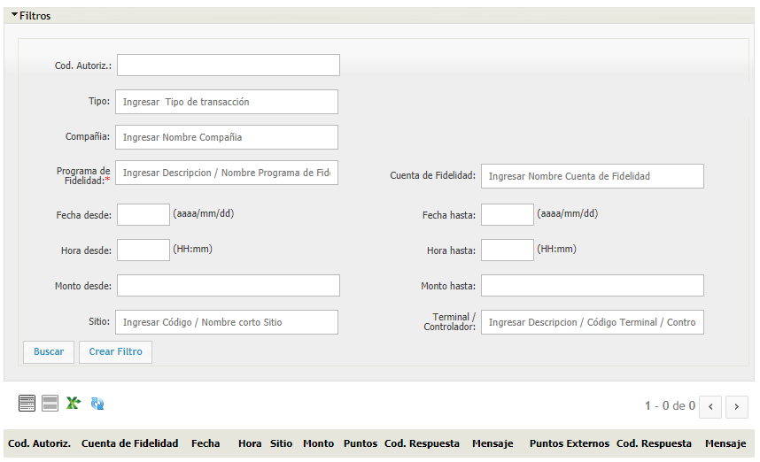

# ATIONet - Manual de Fidelidad

<table>
	<tr>
		<th colspan="2" align="left">Información documento</th>
	</tr>
	<tr>
		<td>Archivo:</td>
		<td>AN-Loyalty-UserManal-SP</td>
	</tr>
	<tr>
		<td>Version documento:</td>
		<td>1.0</td>
	</tr>
	<tr>
		<td>Fecha:</td>
		<td>15 Febrero 2018</td>
	</tr>
	<tr>
		<td>Autor:</td>
		<td>ATIO International LLC</td>
	</tr>
</table>

<table>
	<tr>
		<th colspan="3" align="left">Change Log</th>
	</tr>
	<tr>
		<td>Ver.</td>
		<td>Fecha</td>
		<td>Detalle cambio</td>
	</tr>
	<tr valign="top">
		<td>1.0</td>
		<td>15 Febrero 2018</td>
		<td>Version inicial.</td>
	</tr>
</table>

## Contents

<!-- MarkdownTOC depth=3 -->

- Visión general
- [Definiciones](#definiciones)
	- [Contrato](#contrato) 
	- [Sub cuenta](#sub-cuenta)
	- [Compañía](#compañía)
	- [Identificador](#identificador)
	- [Sitio](#sitio)
	- [Vehículo](#vehículo)
	- [Conductor](#conductor)
	- [Modulo offline](#modulo-offline)
	- [Terminal] (#terminal)
- [Fidelidad](#fidelidad)
	- [Ajustes](#ajustes)
	- [Cliente de Fidelidad](#cliente-de-fidelidad)
	- [Conciliaciones](#conciliaciones)
	- [Cuenta Corriente](#cuenta-corriente)
	- [Excepciones](#excepciones)
	- [Programas](#programas)
	- [Redenciones](#redenciones)
	- [Reglas](#reglas)
	- [Transacciones](#transacciones)
	- [Transferencias](#transferencias)
	- [Unidades](#unidades)

<!-- /MarkdownTOC -->

## Visión General

ATIOnet se basa en la premisa de que las comunicaciones online entre sitios y el portal web son posibles, sin embargo, provee sólidos procedimientos de contingencia en el caso de que ocurra un error de comunicación.

La plataforma de ATIOnet es un servicio de administración de flotas con una innovadora y única oferta de mercado. Procesamiento en la nube, 100% web-based, acceso multi-usuario, disponibilidad y compartimiento de datos, actualizaciones instantáneas, seguridad, back-up automático y reducción de papeleo.

ATIOnet es un portal web para compañías de servicios de flotas que permite el procesamiento de transacciones desde cualquier aplicación de punto de venta mediante una interfaz simple y confiable. 

ATIOnet puede ser instalado en cualquier estación de servicio con uno o múltiples programas de servicios de flotas. El portal web le permite a los administradores de flotas acceso total a la información de sus vehículos.

ATIOnet hace posible que el administrador de flota opere, monitoree, cambie y edite la información de la flota en tiempo real.

## Definiciones

### Contrato 

El contrato es la relación que existe entre la network y el cliente, en el que se pauta, por ejemplo, si sera de importe o volumen, el precio al que se le va a vender el combustible, en que sitios puede cargar, entre otros.

### Sub Cuenta 

Cada vez que se asocia un identificador a un vehículo o un conductor se crea una sub cuenta. La sub cuenta es en definitiva quien va a tener una cuenta corriente, la sub cuenta va a poder recibir depósitos de dinero o producto. Las reglas también impactan a la sub cuenta.

Las sub cuentas dependen jerarquicamente del contrato.

### Compañía 

En ATIOnet, la compañía se refiere a la empresa dueña de la flota.

### Identificador 

El identificador es el medio físico que utiliza ATIONet para poder identificar un vehículo o un conductor. ATIONet soporte varios tipos de identificaciones, como ser tarjeta, tag (anillo), chip, tarjeta ATIONet, entrada manual, código de barras e iButton. Cuando se asocia un identificador a un Vehículo o Conductor se crea una sub cuenta.

### Sitio 

El Sitio representa a la estación de servicio. A un sitio se le asigna la terminal y también puede tener asociadas reglas de Ubicación.

### Modulo Offline 

El modulo offline de ATIONet se activa automáticamente cuando la estación de servicio se queda sin conexión a Internet y las autorizaciones no se pueden procesar online. En este momento entra en juego el modulo offline. Para el controlador Nano CPI es totalmente transparente. Cuando el modulo offline recupera la conectividad envía toda la información procesada localmente y también baja las novedades. Mientras haya conectividad el modulo offline esta continuamente bajando las novedades (saldos, identificadores, reglas, etc) de ATIONet.

### Terminal

La terminal (o controlador) es la representación del controlador de surtidores, que necesita parametrizarse de manera particular según el tipo de terminal. Las terminales que ATIONet maneja son ATIO-NanoCPI, ATIO-Standalone, ATIO-CG, VF-Standalone, VF-Sapphire, VF-Ruby, ControlGas y OPW-FSC3000. 

## Fidelidad

### Ajustes

Lorem ipsum dolor sit amet, consectetur adipiscing elit. Vivamus mollis quam ac ligula maximus, vitae dictum lorem consequat. Curabitur interdum pretium cursus. Vestibulum pharetra sodales enim, ut vestibulum dui semper quis. Aliquam convallis nulla eu neque vestibulum eleifend. Nam feugiat leo a bibendum rutrum. Duis quis augue et dui vulputate rhoncus. Sed vitae felis fringilla, lacinia est vel, imperdiet leo. Sed suscipit neque risus, eu pharetra dolor rhoncus ac.

### Cliente de Fidelidad

Lorem ipsum dolor sit amet, consectetur adipiscing elit. Vivamus mollis quam ac ligula maximus, vitae dictum lorem consequat. Curabitur interdum pretium cursus. Vestibulum pharetra sodales enim, ut vestibulum dui semper quis. Aliquam convallis nulla eu neque vestibulum eleifend. Nam feugiat leo a bibendum rutrum. Duis quis augue et dui vulputate rhoncus. Sed vitae felis fringilla, lacinia est vel, imperdiet leo. Sed suscipit neque risus, eu pharetra dolor rhoncus ac.

### Conciliaciones

En ATIONet, las conciliaciones son ?

En esta vista puede ver todas las conciliaciones listadas por Código de Autorización de la misma, la cuenta de Fidelidad relacionada a la excepción, la fecha, hora y sitio donde ocurre la conciliación; el monto, la cantidad de puntos, el código de respuesta de la misma con el mensaje; los puntos externos de la conciliación, su código de respuesta y el mensaje. También cuenta con un botón para descargar una plantilla con los datos de las conciliaciones.

Para hacer las consultas mas fáciles, esta vista cuenta con un panel de filtros.

Los campos disponibles para filtrar son los siguientes:

* ***Cod. Autorización***: Filtre por el código de autorización de la conciliación.
* ***Tipo***: Filtre por el tipo de transacción que se realizo.
* ***Compañía***: Filtre por compañía.
* ***Programa de Fidelidad***: Filtre por el programa de fidelidad asociado a la conciliación.
* ***Cuenta de Fidelidad***: Filtre por la cuenta de fidelidad asociada a la conciliación.
* ***Fecha Desde/Fecha Hasta***: Ingrese el rango de fechas por el cual quiere filtrar.
* ***Hora Desde/Hora Hasta***: Ingrese el rango horario por el cual quiere filtrar.
* ***Monto Desde/Monto Hasta***: Ingrese el rango de montos por el cual quiere filtrar.
* ***Sitio***: Filtre por el sitio donde ocurrió la conciliación.
* ***Terminal/Controlador***: Filtre por la terminal/controlador que realizo la conciliación.

Cuando termine de llenar los campos que quiera, puede cliquear en "Crear Filtro" para guardarlo para futuras ocasiones, o simplemente en "Buscar" para filtrar los resultados.

### Cuenta Corriente

En ATIONet, las cuentas corrientes son ?

En esta vista puede ver todas las cuentas corrientes listadas por Compañía, Programa de Fidelidad, Subcuenta, Balance y si esta Habilitada o no.

Para hacer las consultas mas faciles, esta vista cuenta con un panel de filtros.

Los campos disponibles para filtrar son los siguientes:

* ***Compañía***: Filtre por el nombre de la Compañía.
* ***Programa de Fidelidad***: Filtre por el programa de fidelidad.
* ***Cuentas de Fidelidad***: Filtre por cuenta de fidelidad.
* ***Fecha Desde/Fecha Hasta***: Ingrese el rango de fechas por el cual quiere filtrar.
* ***Hora Desde/Hora Hasta***: Ingrese el rango horario por el cual quiere filtrar.
* ***Monto Desde/Monto Hasta***: Ingrese el rango de montos por el cual quiere filtrar.
* ***Reporte***: Elija entre crédito o débito.
* ***Tipo***: Filtre por acumulación, redención, transferencia, ajuste o expiración.
* ***Origen***: Filtre por el origen de la cuenta corriente. Puede ser sistema web, sistema móvil, batch, transacción, interfaz API, legacy API, migración o liquidaciones.

Cuando termine de llenar los campos que quiera, puede cliquear en "Crear Filtro" para guardarlo para futuras ocasiones, o simplemente en "Buscar" para filtrar los resultados.

### Excepciones

En ATIONet, las excepciones son aquellas transacciones que fueron rechazadas por algún motivo.

En esta vista puede ver todas las excepciones listadas por Estado, Código de Autorización, la Cuenta de Fidelidad relacionada con la excepción; la Fecha, Hora y el Sitio donde ocurrió la excepción, la cantidad de puntos, el monto y el motivo de la excepción. También cuenta con un botón para descargar una plantilla con los datos de las excepciones.

Para hacer las consultas mas faciles, esta vista cuenta con un panel de filtros.

Los campos disponibles para filtrar son los siguientes:

* ***Cod. Autorización***: Filtre por el código de autorización de la excepción.
* ***Tipo***: Filtre por el tipo de transacción que se realizo.
* ***Compañía***: Filtre por Compañía.
* ***Programa de Fidelidad***: Filtre por el programa de fidelidad asociado a la excepción.
* ***Cuenta de Fidelidad***: Filtre por la cuenta de fidelidad asociada a la excepción.
* ***Fecha Desde/Fecha Hasta***: Ingrese el rango de fechas por el cual quiere filtrar.
* ***Hora Desde/Hora Hasta***: Ingrese el rango horario por el cual quiere filtrar.
* ***Monto Desde/Monto Hasta***: Ingrese el rango de montos por el cual quiere filtrar.
* ***Sitio***: Filtre por el sitio donde ocurrió la excepción.
* ***Terminal/Controlador***: Filtre por la terminal/controlador que realizo la excepción.

Cuando termine de llenar los campos que quiera, puede cliquear en "Crear Filtro" para guardarlo para futuras ocasiones, o simplemente en "Buscar" para filtrar los resultados.

### Programas

En ATIONet, los programas son ?

#### Crear un nuevo programa

Para crear un nuevo programa, haga click en el botón "Nuevo" que se encuentra en el extremo superior izquierdo de la vista.

Los campos a completar son los siguientes:

* ***Código***: El código que le quiere asignar al programa.
* ***Activo***: Tilde esta opción si el programa estará activo.
* ***Descripcion***: Ingrese una breve descripción del programa.
* ***Procesa Host Externo***: Tilde esta opción si el programa procesa host externo.
* ***Tipo de Miembros***: Seleccione si es de tipo vehículo, conductor o compañía.
* ***Soporta Identificacion Dual***: Tilde esta opción si quiere que el programa soporte identificacion dual.
* ***Fecha Inicio***: Ingrese la fecha en la que entra en vigencia el contrato.
* ***Duración***: Ingrese la duración del contrato.
* ***Compañía***: Ingrese la compañía con la cual esta relacionada el contrato.
* ***Grupo de tipo de entrada de servicios***: ?
* ***Unidades***: Seleccione en que unidad quiere que sea el contrato.
* ***Monto Inicial***: ?
* ***Encuesta Inicial***: ?
* ***Sitios***: ?
* ***Tipo de Expiración***: ?
* ***Periodicidad***: ?
* ***Días de Gracia***: ?

Cuando termine de llenar todos los campos, haga click en el botón "Guardar".

### Redenciones

Las redenciones son cuando se hace el canje de puntos por un producto. En esta vista puede consultar las redenciones listadas por Sitio, Fecha y Hora, la cuenta de Fidelidad que realizo la redención, la cantidad de puntos que se usaron en la transacción, el código de respuesta y el mensaje de respuesta.

Esta vista cuenta con un panel de filtros para hacer mas faciles las consultas.

Los campos disponibles para filtrar son los siguientes:

* ***Vehículo***: El vehículo por el cual se quiere filtrar.
* ***Conductor***: El conductor por el cual se quiere filtrar.
* ***Sitio***: El sitio por el cual se quiere filtrar.
* ***Terminal/Controlador***: La terminal/controlador por el cual se quiere filtrar.
* ***Fecha Desde/Fecha Hasta***: Ingrese el rango de fechas por el cual quiere filtrar redenciones.
* ***Hora Desde/Hora Hasta***: Ingrese el rango horario por el cual quiere filtrar redenciones.

Cuando termine de llenar los campos que quiera, puede cliquear en "Crear Filtro" para guardarlo para futuras ocasiones, o simplemente en "Buscar" para filtrar los resultados.

#### Crear una nueva redención

Para crear una nueva redención, haga click en el botón "Nuevo" que se encuentra en el extremo superior izquierdo de la vista.

Los campos a completar son los siguientes:

* ***Descripción***: Ingrese una descripción de la redención.
* ***Fecha y Hora***: Ingrese la fecha y hora en la que ocurre la redención.
* ***Sitio***: Ingrese el sitio en donde ocurre la redención.
* ***Terminal/Controlador***: Ingrese la terminal/controlador con la que se realiza la redención.
* ***Programa de Fidelidad***: Ingrese el programa de fidelidad asociado a la redención.
* ***Cuenta de Fidelidad***: Ingrese la cuenta de fidelidad asociada a la redención.

* ***SKU***: Ingrese el código del SKU de la redención.
* ***Cantidad***: Ingrese la cantidad de unidades de la redención.

Cuando termine de llenar esos dos campos, haga click el botón de "Alta" para confirmar.

Cuando termine de llenar todos los campos, haga click en botón "Guardar".

### Reglas

En ATIONet las reglas son la forma en la que se computan los puntos en el sistema de fidelidad. 

En esta vista usted puede consultar las reglas listadas por Código, Descripcion, Puntos, Fecha y Hora Desde/Hasta. También puede editar la regla haciendo click en el icono del lápiz que se encuentra en la columna opciones.

#### Crear una nueva regla

Para crear una nueva regla, haga click en el botón "Nuevo" que se encuentra en el extremo superior izquierdo de la vista.

Los campos a completar son los siguientes:

* ***Código***: El código que le quiere asignar a la nueva regla.
* ***Descripcion***: La descripción de la nueva regla.
* ***Tipo***: Seleccione el tipo de regla que puede ser de Monto de Transacción, SKU, Categoría de SKU, Método de Pago, Monto de Transacción y Método de Pago, SKU y Método de Pago o Categoría de SKU y Método de Pago.
* ***Puntos***: La cantidad de puntos que entrega la regla.
* ***Unidades/Monto***: ?
* ***Monto***: ?
* ***Fecha Desde/Hasta***: Ingrese el rango de fechas en el cual estará activa la regla.
* ***Hora Desde/Hasta***: Ingrese el rango horario en el cual estará activa la regla.
* ***Días de la semana habilitados***: Ingrese los días de la semana en los cuales estará activa la regla.
* ***Programa de Fidelidad***: Ingrese el programa de fidelidad al cual le quiere asignar esta regla.

Cuando termine de llenar los campos cliquée el botón "Guardar".

### Transacciones

En esta vista usted puede consultar las transacciones realizadas, listadas por Código de Autorización, la Cuenta de Fidelidad a la que esta asociada la transacción; La fecha, la hora y el sitio donde ocurrió la transacción, la cantidad de puntos que fueron otorgados por esa transacción, y el monto de la transacción. También cuenta con un botón para descargar una plantilla con los datos de las transacciones.

Esta vista cuenta con un panel de filtros para hacer mas faciles las consultas. Los campos que tiene disponibles para filtrar son los siguientes:

* ***Cod. Autorización***: El código de autorización de la transacción.
* ***Tipo***: El tipo de transacción (Puede ser de Acumulación, Redención, Transferencia, Ajuste o Devolución).
* ***Compañía***: Ingrese el nombre de la compañía el cual quiere buscar transacciones relacionadas a ella.
* ***Programa de Fidelidad***: Ingrese el nombre del programa de fidelidad el cual quiere buscar transacciones relacionadas a ella.
* ***Cuenta de Fidelidad***: Ingrese el nombre de la cuenta de fidelidad el cual quiere buscar transacciones relacionadas a ella.
* ***Fecha Desde/Fecha Hasta***: Ingrese el rango de fechas por el cual quiere filtrar transacciones.
* ***Hora Desde/Hora Hasta***: Ingrese el rango horario por el cual quiere filtrar transacciones.
* ***Monto Desde/Monto Hasta***: Ingrese el rango de montos por el cual quiere filtrar transacciones.
* ***Sitio***: Ingrese el sitio por el cual quiere filtrar transacciones.
* ***Terminal/Controlador***: Ingrese la terminal/controlador por el cual quiere filtrar transacciones.

Cuando termine de llenar los campos que quiera, puede cliquear en "Crear Filtro" para guardarlo para futuras ocasiones, o simplemente en "Buscar" para filtrar los resultados.

### Transferencias

En esta vista usted puede consultar las transacciones realizadas, listadas por Sitio, Fecha y Hora; la cuenta de Fidelidad de donde fueron transferidos los puntos y la cuenta de Fidelidad a la que fueron transferidos los puntos, la cantidad de puntos, el código de respuesta de la transferencia y el mensaje respuesta que arrojo la transferencia.

Esta vista cuenta con un panel de filtros para hacer mas faciles las consultas. Los campos que tiene disponibles para filtrar son los siguientes:

* ***Vehículo***: ?
* ***Conductor***: ?
* ***Sitio***:
* ***Terminal/Controlador***:
* ***Fecha Desde/Fecha Hasta***: Ingrese el rango de fechas por el cual quiere filtrar transferencias.
* ***Hora Desde/Hora Hasta***: Ingrese el rango horario por el cual quiere filtrar transacciones.

Cuando termine de llenar los campos que quiera, puede cliquear en "Crear Filtro" para guardarlo para futuras ocasiones, o simplemente en "Buscar" para filtrar los resultados.

### Unidades

En ATIONet, las unidades son ?

#### Crear una nueva unidad

Para crear una nueva unidad haga click en el botón "Nuevo" que se encuentra en el extremo superior izquierdo de la pantalla".

Los campos  completar son los siguientes:

* ***Código***: El código que le quiere asignar a la nueva unidad.
* ***Nombre***: El nombre que le quiere asignar a la nueva unidad.
* ***Código de Moneda***: ?