# ATIONet - Manual de Usuario Autoconsumo

<table>
	<tr>
		<th colspan="2" align="left">Informacion documento</th>
	</tr>
	<tr>
		<td>Archivo:</td>
		<td>AN-HomeBase-UserManal-SP</td>
	</tr>
	<tr>
		<td>Version documento:</td>
		<td>1.0</td>
	</tr>
	<tr>
		<td>Fecha:</td>
		<td>15 Enero 2016</td>
	</tr>
	<tr>
		<td>Autor:</td>
		<td>ATIO International LLC</td>
	</tr>
</table>

<table>
	<tr>
		<th colspan="3" align="left">Change Log</th>
	</tr>
	<tr>
		<td>Ver.</td>
		<td>Fecha</td>
		<td>Detalle cambio</td>
	</tr>
	<tr valign="top">
		<td>1.0</td>
		<td>15 Enero 2016</td>
		<td>Version inicial.</td>
	</tr>
</table>

## Contents

<!-- MarkdownTOC depth=3 -->

- Visión general
- Menú de Navegación
	- Tablero
		- Estado General
		- Litros / Mes
		- Transacciones del Día
		- Lista de Pre-Autorizaciones Pendientes
		- Transacciones marcadas en ultimo mes
		- Instalaciones
		- Sub-cuentas con excepciones
		- Actualizaciones de Identificador en ultimo mes
		- Transacciones recientes
		- Listado de Sub-cuentas con bajo saldo
		- Estado de Terminales
		- Contratos sin actividad
		- Listado de contratos con bajo saldo
	- Vistas
		- Autorizaciones Pendientes
		- Batch
		- Conductores
		- Cuentas corrientes de Compañia
		- Excepciones
		- Rendimiento por Transacción
		- Rendimiento por Vehiculo
		- Transacciones
		- Transacciones por Conductor
		- Transacciones por Flota
		- Transacciones por Sitio
		- Transacciones por Vehiculo
		- Transacciones Rechazadas
		- Transacciones sin Control
		- Vehiculos
	- Reportes
		- Conductor
		- Detalle de actividad por Vehiculo
		- Sitios
		- Transacciones
		- Vehiculo
	- Inventario
		- Grafico de Inventarios
		- Inventario
		- Recepciones
		- Reconciliazión Inventario
	- Administración
		- Clases de Vehiculos
		- Combustibles
		- Conceptos
		- Conductores
		- Configuración
		- Configuración de Fast Track
		- Contratos de Compañia
		- Familias de Conceptos
		- Flotas
		- Identificaciones Solicitadas
		- Identificadores
		- Impuestos
		- Metodos de Pago
		- Modelos de Identificador
		- Programas
		- Reglas
		- Sitios
		- Terminales / Controladores
		- Tipos de Documentos
		- Transacciones Desconocidas
		- Transacciones Fuera de Sitio
		- Usuarios
		- Vehículos
- Definiciones
	- Sub cuenta
- Solución de Problemas

<!-- /MarkdownTOC -->

## Visión General
Lorem ipsum dolor sit amet, consectetur adipiscing elit. Vivamus mollis quam ac ligula maximus, vitae dictum lorem consequat. Curabitur interdum pretium cursus. Vestibulum pharetra sodales enim, ut vestibulum dui semper quis. Aliquam convallis nulla eu neque vestibulum eleifend. Nam feugiat leo a bibendum rutrum. Duis quis augue et dui vulputate rhoncus. Sed vitae felis fringilla, lacinia est vel, imperdiet leo. Sed suscipit neque risus, eu pharetra dolor rhoncus ac.

## Menú de Navegación
Ationet posee un menú de acceso rápido ubicado en la parte izquierda de la pagina. Desde este menú usted podrá acceder a las distintas opciones. el menú esta dividido en 7 secciones. (Tablero, Favoritos, Vistas, Reportes, Inventario, Administración y Bitácora)

### Tablero
El Tablero es una pagina donde usted tendrá una visión global de la operación de su red. El tablero posee widgets específicos que lo ayudaran a tomar decisiones preventiva o correctivas según la información y los datos que muestren. Los datos que se muestran en el Tablero, son datos en tiempo real. Algunos de los widgets se refrescan automáticamente.
Los widgets se pueden quitar o agregar según las necesidades del usuario. También se pueden acomodar en el tablero según el nivel de visibilidad que le quiera dar a cada uno.
La lista completa de widgets disponibles para las suscripciones "Autoconsumo" es la siguiente:
#### Estado General
Este widget es de suma importancia al poner en marcha la red. Este widget nos da información de que parámetros necesitamos configurar para quedar operativos. Nos advierte cuando por ejemplo no tenemos vehículos o identificaciones creadas entre otros parámetros.
Este widget puede mostrar "Advertencias" (icono amarillo)cuando no esta en juego la operación de la red, pero si muestra una cruz roja indica que la red no esta operativa. 

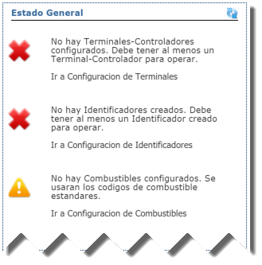
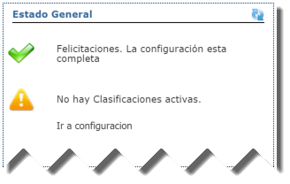

#### Litros/Mes
El widget "Litros/Mes indica la cantidad que se despacho de cada combustible en el ultimo mes. Como ultimo mes se entiende a los últimos 30 días contando desde el día de la fecha. Este widget posee la capacidad de filtrar por Sitio, Ciudad y Flota. Se debe seleccionar el filtro y después se tipea el valor por el cual se debe filtrar. Este ultimo campo es del tipo "auto complete".

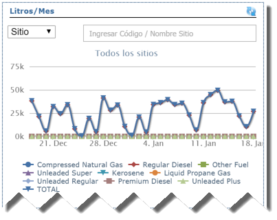

#### Transacciones del Día
Este widget contiene un gráfico de torta que en forma muy rápida se pueden ver cuantas transacciones se aprobaron y cuantas se rechazaron en el día.

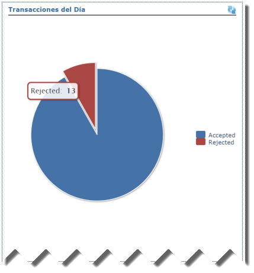

#### Lista de Pre-Autorizaciones Pendientes
Este widget del tipo lista, muestra todas las pre autorizaciones que todavía no recibieron la transacción de finalización. (para mas detalles sobre el flujo de transacciones consulte este documento: [TODO](#todo)).
Este widget muestra 7 columnas:

1. Código de Autorización: El código de autorización asignado a la transacción
2. Compañía: La compañía a la que pertenece el vehículo en cuestión
3. Patente: La patente del vehículo
4. Sitio: El sitio donde se llevo a cabo la transacción
5. Autorizado: el monto que fue autorizado en la pre autorización
6. Pos: Posición o bomba informada por el punto de venta o controlador
7. Age: El tiempo en minutos que lleva vigente esa pre autorización

Las pre autorizaciones pendientes deberían ser despachos en curso, si hay registros en este widget con un Age alto, significa que el punto de venta o controlador no enviaron la transacción de finalización o la transacción de cancelación en el caso que no se haya despachado combustible.

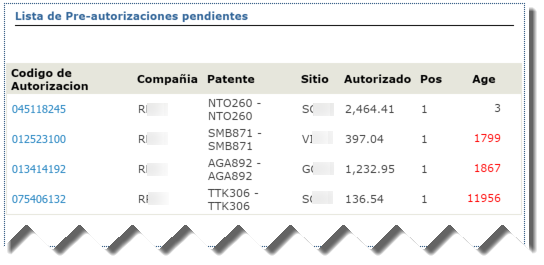

#### Transacciones marcadas en ultimo mes
Este widget muestra todas las transacciones que fueron rechazadas por cualquiera de las validaciones que hace Ationet en el proceso de autorización. Ya sean por falta de saldo o reglas entre otras validaciones. Para mas detalles sobre "Transacciones Rechazadas" consulte este documento: [TODO](#todo) 

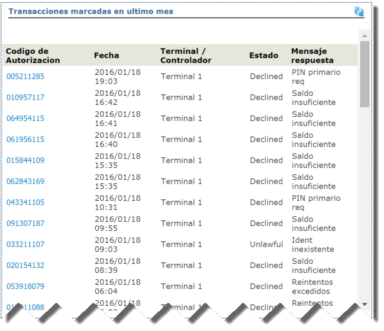

#### Instalaciones
Cuando la red utiliza algún medio de identificación que requiera ser instalado (como por ejemplo un anillo o ring tag), Ationet administra la lista de instalaciones. Este widget muestra las instalaciones realizadas en las ultimas 5 semanas

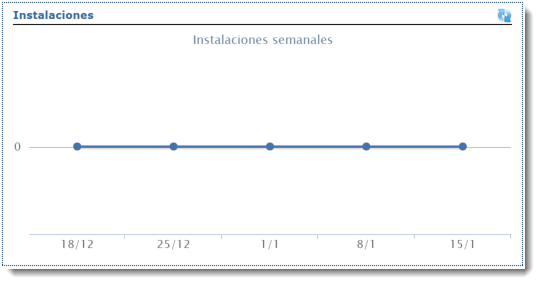

#### Sub-cuentas con excepciones
Para mas detalles sobre sub cuentas consulte este documento: [TODO](#todo)
Este widget muestra todas las sub cuentas que tengan algo que prestarle atención, como por ejemplo:

1. **Sin Identificadores:** Son los vehículos o conductores que no tienen un identificador asociado
2. **Con Identificadores inactivos:** Son subcuentas que que tienen un identificador asociado que ha sido desactivado desde el portal
3. **Con Identificadores suspendidos:** Son subcuentas que que tienen un identificador que ha sido suspendido. ***Solo Ationet puede suspender un identificador***.
4. **Con conductores o vehículos inactivos:** Son subcuentas que que tienen un vehículo o conductor que no ha sido desactivado desde el portal

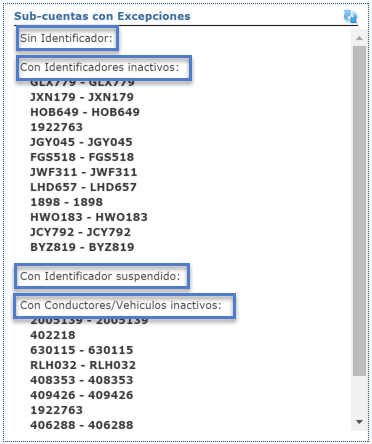

#### Actualizaciones de Identificador en ultimo mes
Este widget muestra la actividad de la administración de los identificadores, muestra la cantidad de identificadores que fueron modificados agrupado por estado.

1. **Asignada:** La cantidad de identificadores que cambiaron al estado "Asignada"
2. **Disponible:** La cantidad de identificadores que cambiaron al estado "Disponible"
3. **Cancelada:** La cantidad de identificadores que cambiaron al estado "Cancelada"
4. **Denunciada:** La cantidad de identificadores que cambiaron al estado "Denunciada"
5. **Suspendida:** La cantidad de identificadores que cambiaron al estado "Suspendida"

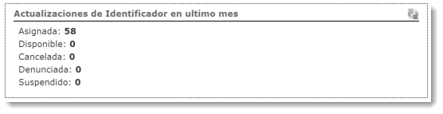

#### Transacciones recientes
Este widget muestra las ultimas 20 transacciones finalizadas. Se muestran los datos mas relevantes para poder identificarla, en el caso de necesitar mas información sobre la transacción se puede hacer click sobre el código de autorización, eso lo llevara a la vista de detalles de la transacción.

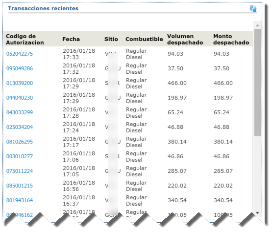

#### Listado de Sub-cuentas con bajo saldo
Este widget muestra la lista de sub cuentas que contengan bajo saldo para operar 4 días mas. Este calculo se hace en base al uso de cada sub cuenta. La columna "Días disponibles" muestra cantidad de días que le quedan a la sub cuenta basada en el análisis de uso. Este numero no es exacto y podría variar si el patrón de uso cambia.

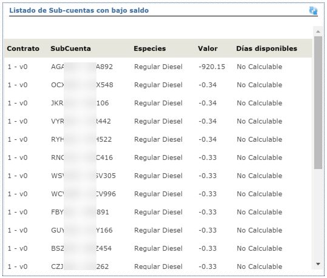

#### Estado de Terminales
Todas las terminales que estén conectadas en forma nativa a ATIONet, envían en forma regular un mensaje indicando que están activas. Si la terminal reporto el estado en las ultimas 5 horas, la terminal se mostrara con el icono verde, sino se reporto en las ultimas 5 horas el icono sera rojo.
La columna ***"Age"*** muestra la cantidad de minutos que pasaron desde la ultima vez que se reporta la terminal. 

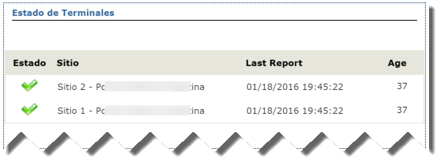
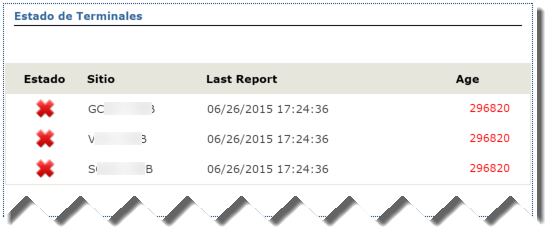

#### Contratos sin actividad
Este widget muestra la lista de contratos que nunca tuvieron actividad.

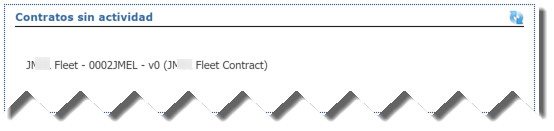

#### Listado de contratos con bajo saldo
Este widget muestra la lista de contratos que contengan bajo saldo para operar 4 días mas. Este calculo se hace en base al uso. La columna "Días disponibles" muestra cantidad de días que le quedan al contrato basada en el análisis de uso. Este numero no es exacto y podría variar si el patrón de uso cambia.

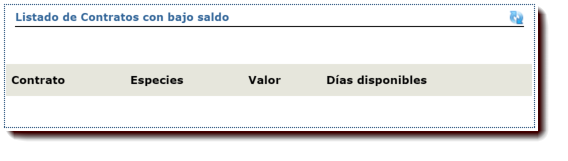

## Solución de Problemas
Lorem ipsum dolor sit amet, consectetur adipiscing elit. Vivamus mollis quam ac ligula maximus, vitae dictum lorem consequat. Curabitur interdum pretium cursus. Vestibulum pharetra sodales enim, ut vestibulum dui semper quis. Aliquam convallis nulla eu neque vestibulum eleifend. Nam feugiat leo a bibendum rutrum. Duis quis augue et dui vulputate rhoncus. Sed vitae felis fringilla, lacinia est vel, imperdiet leo. Sed suscipit neque risus, eu pharetra dolor rhoncus ac.