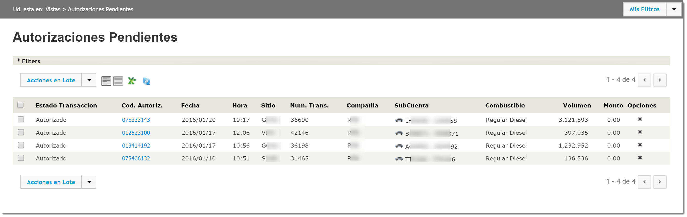
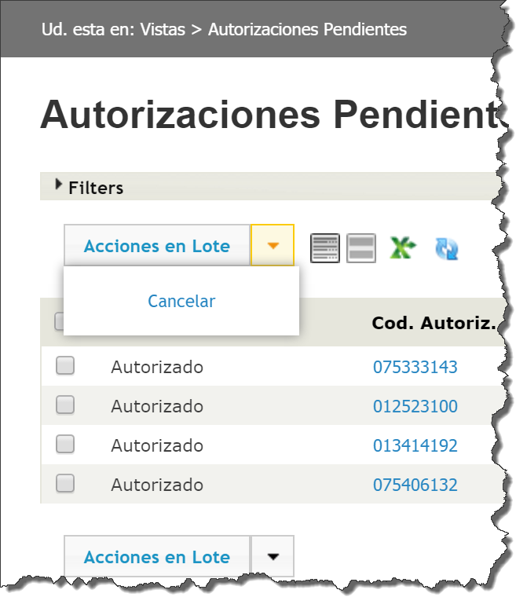
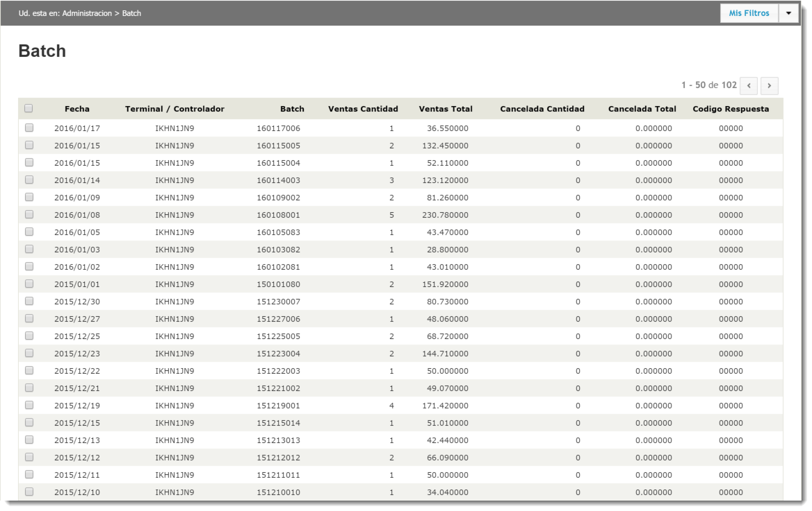
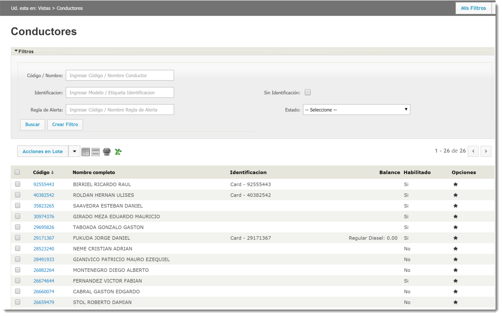
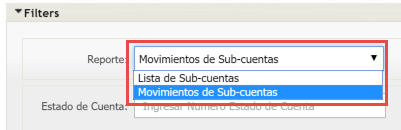
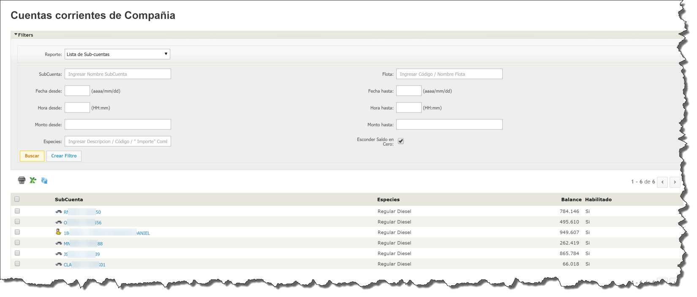

# ATIONet - Manual de Usuario Autoconsumo

<table>
	<tr>
		<th colspan="2" align="left">Informacion documento</th>
	</tr>
	<tr>
		<td>Archivo:</td>
		<td>AN-HomeBase-UserManal-SP</td>
	</tr>
	<tr>
		<td>Version documento:</td>
		<td>1.0</td>
	</tr>
	<tr>
		<td>Fecha:</td>
		<td>15 Enero 2016</td>
	</tr>
	<tr>
		<td>Autor:</td>
		<td>ATIO International LLC</td>
	</tr>
</table>

<table>
	<tr>
		<th colspan="3" align="left">Change Log</th>
	</tr>
	<tr>
		<td>Ver.</td>
		<td>Fecha</td>
		<td>Detalle cambio</td>
	</tr>
	<tr valign="top">
		<td>1.0</td>
		<td>15 Enero 2016</td>
		<td>Version inicial.</td>
	</tr>
</table>

## Contents

<!-- MarkdownTOC depth=3 -->

- Visión general
- Menú de Navegación
	- [Tablero](#tablero)
		- [Estado General](#estado-general)
		- [Litros/Mes](#litras/mes)
		- [Transacciones del Día](#transacciones-del-dia)
		- [Lista de Pre-Autorizaciones Pendientes](#lista-de-pre-autorizaciones-pendientes)
		- [Transacciones marcadas en ultimo mes](#transacciones-marcadas-en-ultimo-mes)
		- [Instalaciones](#instalaciones)
		- [Sub-cuentas con excepciones](#sub-cuentas-con-excepciones)
		- [Actualizaciones de Identificador en ultimo mes](#actualizaciones-de-identificador-en-ultimo-mes)
		- [Transacciones recientes](#transacciones-recientes)
		- [Listado de Sub-cuentas con bajo saldo](#listado-de-sub-cuentas-con-bajo-saldo)
		- [Estado de Terminales](#estado-de-terminales)
		- [Contratos sin actividad](#contratos-sin-actividad)
		- [Listado de contratos con bajo saldo](#listado-de-contratos-con-bajo-saldo)
	- [Favoritos](#tablero)	
	- [Vistas](#vistas)
		- [Autorizaciones Pendientes](#autorizaciones-pendientes)
		- [Batch](#batch)
		- [Conductores](#conductores)
		- [Cuentas corrientes de Compañia](#cuentas-corrientes-de-compañía)
		- [Excepciones](#excepciones)
		- Rendimiento por Transacción
		- Rendimiento por Vehiculo
		- [Transacciones](#transacciones)
		- Transacciones por Conductor
		- Transacciones por Flota
		- Transacciones por Sitio
		- Transacciones por Vehiculo
		- [Transacciones Rechazadas](#transacciones-rechazadas)
		- [Transacciones sin Control](#transacciones-sin-control)
		- Vehiculos
	- Reportes
		- Conductor
		- Detalle de actividad por Vehiculo
		- Sitios
		- Transacciones
		- Vehiculo
	- Inventario
		- Grafico de Inventarios
		- Inventario
		- Recepciones
		- Reconciliazión Inventario
	- Administración
		- Clases de Vehiculos
		- Combustibles
		- Conceptos
		- Conductores
		- Configuración
		- Configuración de Fast Track
		- Contratos de Compañia
		- Familias de Conceptos
		- Flotas
		- Identificaciones Solicitadas
		- Identificadores
		- Impuestos
		- Metodos de Pago
		- Modelos de Identificador
		- Programas
		- Reglas
		- Sitios
		- Terminales / Controladores
		- Tipos de Documentos
		- Transacciones Desconocidas
		- Transacciones Fuera de Sitio
		- Usuarios
		- Vehículos
- [Definiciones](#definiciones)
	- [Sub cuenta](#sub-cuenta)
	- [Compañia](#compañia)
- [Solución de Problemas](#solucion-de-problemas)
- [Mis Preferencias](#mis-preferencias)
- [Configuración Nano CPI para ATIONet](#configuración-nano-cpi-para-ationet)

<!-- /MarkdownTOC -->

## Visión General
Lorem ipsum dolor sit amet, consectetur adipiscing elit. Vivamus mollis quam ac ligula maximus, vitae dictum lorem consequat. Curabitur interdum pretium cursus. Vestibulum pharetra sodales enim, ut vestibulum dui semper quis. Aliquam convallis nulla eu neque vestibulum eleifend. Nam feugiat leo a bibendum rutrum. Duis quis augue et dui vulputate rhoncus. Sed vitae felis fringilla, lacinia est vel, imperdiet leo. Sed suscipit neque risus, eu pharetra dolor rhoncus ac.

## Menú de Navegación
Ationet posee un menú de acceso rápido ubicado en la parte izquierda de la pagina. Desde este menú usted podrá acceder a las distintas opciones. el menú esta dividido en 7 secciones. (Tablero, Favoritos, Vistas, Reportes, Inventario, Administración y Bitácora)

### Tablero
El Tablero es una pagina donde usted tendrá una visión global de la operación de su red. El tablero posee widgets específicos que lo ayudaran a tomar decisiones preventiva o correctivas según la información y los datos que muestren. Los datos que se muestran en el Tablero, son datos en tiempo real. Algunos de los widgets se refrescan automáticamente.
Los widgets se pueden quitar o agregar según las necesidades del usuario. También se pueden acomodar en el tablero según el nivel de visibilidad que le quiera dar a cada uno.
La lista completa de widgets disponibles para las suscripciones "Autoconsumo" es la siguiente:
#### Estado General ####
Este widget es de suma importancia al poner en marcha la red. Este widget nos da información de que parámetros necesitamos configurar para quedar operativos. Nos advierte cuando por ejemplo no tenemos vehículos o identificaciones creadas entre otros parámetros.
Este widget puede mostrar "Advertencias" (icono amarillo)cuando no esta en juego la operación de la red, pero si muestra una cruz roja indica que la red no esta operativa. 

#### Litros/Mes
El widget "Litros/Mes indica la cantidad que se despacho de cada combustible en el ultimo mes. Como ultimo mes se entiende a los últimos 30 días contando desde el día de la fecha. Este widget posee la capacidad de filtrar por Sitio, Ciudad y Flota. Se debe seleccionar el filtro y después se tipea el valor por el cual se debe filtrar. Este ultimo campo es del tipo "auto complete".

#### Transacciones del Dia
Este widget contiene un gráfico de torta que en forma muy rápida se pueden ver cuantas transacciones se aprobaron y cuantas se rechazaron en el día.

#### Lista de Pre-Autorizaciones Pendientes
Este widget del tipo lista, muestra todas las pre autorizaciones que todavía no recibieron la transacción de finalización. (para mas detalles sobre el flujo de transacciones consulte este [documento](AN-Transaction_Flows-TechGuide.md)).
Este widget muestra 7 columnas:

1. ***Código de Autorización:*** El código de autorización asignado a la transacción
2. ***Compañía:*** La compañía a la que pertenece el vehículo en cuestión
3. ***Patente:*** La patente del vehículo
4. ***Sitio:*** El sitio donde se llevo a cabo la transacción
5. ***Autorizado:*** El monto que fue autorizado en la pre autorización
6. ***Pos:*** Posición o bomba informada por el punto de venta o controlador
7. ***Age:*** El tiempo en minutos que lleva vigente esa pre autorización

Las pre autorizaciones pendientes deberían ser despachos en curso, si hay registros en este widget con un Age alto, significa que el punto de venta o controlador no enviaron la transacción de finalización o la transacción de cancelación en el caso que no se haya despachado combustible.

#### Transacciones marcadas en ultimo mes ####
Este widget muestra todas las transacciones que fueron rechazadas por cualquiera de las validaciones que hace Ationet en el proceso de autorización. Ya sean por falta de saldo o reglas entre otras validaciones. Para mas detalles sobre "Transacciones Rechazadas" consulte este documento: [TODO](#todo) 

#### Instalaciones
Cuando la red utiliza algún medio de identificación que requiera ser instalado (como por ejemplo un anillo o ring tag), Ationet administra la lista de instalaciones. Este widget muestra las instalaciones realizadas en las ultimas 5 semanas

#### Sub-cuentas con excepciones
Este widget muestra todas las sub cuentas que tengan algo que prestarle atención, como por ejemplo:

1. ***Sin Identificadores:*** Son los vehículos o conductores que no tienen un identificador asociado
2. ***Con Identificadores inactivos:*** Son subcuentas que que tienen un identificador asociado que ha sido desactivado desde el portal
3. ***Con Identificadores suspendidos:*** Son subcuentas que que tienen un identificador que ha sido suspendido. ***Solo Ationet puede suspender un identificador***.
4. ***Con conductores o vehículos inactivos:*** Son subcuentas que que tienen un vehículo o conductor que no ha sido desactivado desde el portal

Para mas detalles sobre sub cuentas consulte: [Esta sección](#sub-cuenta)

#### Actualizaciones de Identificador en ultimo mes
Este widget muestra la actividad de la administración de los identificadores, muestra la cantidad de identificadores que fueron modificados agrupado por estado.

1. ***Asignada:*** La cantidad de identificadores que cambiaron al estado "Asignada"
2. ***Disponible:*** La cantidad de identificadores que cambiaron al estado "Disponible"
3. ***Cancelada:*** La cantidad de identificadores que cambiaron al estado "Cancelada"
4. ***Denunciada:*** La cantidad de identificadores que cambiaron al estado "Denunciada"
5. ***Suspendida:*** La cantidad de identificadores que cambiaron al estado "Suspendida"

#### Transacciones recientes
Este widget muestra las ultimas 20 transacciones finalizadas. Se muestran los datos mas relevantes para poder identificarla, en el caso de necesitar mas información sobre la transacción se puede hacer click sobre el código de autorización, eso lo llevara a la vista de detalles de la transacción.

#### Listado de Sub-cuentas con bajo saldo
Este widget muestra la lista de sub cuentas que contengan bajo saldo para operar 4 días mas. Este calculo se hace en base al uso de cada sub cuenta. La columna "Días disponibles" muestra cantidad de días que le quedan a la sub cuenta basada en el análisis de uso. Este numero no es exacto y podría variar si el patrón de uso cambia.

#### Estado de Terminales
Todas las terminales que estén conectadas en forma nativa a ATIONet, envían en forma regular un mensaje indicando que están activas. Si la terminal reporto el estado en las ultimas 5 horas, la terminal se mostrara con el icono verde, sino se reporto en las ultimas 5 horas el icono sera rojo.
La columna ***"Age"*** muestra la cantidad de minutos que pasaron desde la ultima vez que se reporta la terminal. 

#### Contratos sin actividad
Este widget muestra la lista de contratos que nunca tuvieron actividad.

#### Listado de contratos con bajo saldo
Este widget muestra la lista de contratos que contengan bajo saldo para operar 4 días mas. Este calculo se hace en base al uso. La columna "Días disponibles" muestra cantidad de días que le quedan al contrato basada en el análisis de uso. Este numero no es exacto y podría variar si el patrón de uso cambia.

### Vistas
ATIONet dispone de una serie de vistas donde se puede visualizar información de la operación de la red. ATIONet considera una vista a toda aquella pantalla que ademas de poder visualizar información, también es exportable para un post procesamiento. A diferencia de los [***Reportes***](#reportes) que son pantallas que muestran información con un formato pensado para ser impreso y guardado.
Todas las vistas en ATIONet respetan una consistencia en estética y funcionalidad. Todas las vistas poseen una barra de herramientas con todas estas funciones (o al menos alguna de ellas)

 

1. ***Vista Condensada:*** Esta opción viene activa de defecto cuando se abre la vista, esta opción muestra en la grilla los datos mínimos en un solo renglón.
2. ***Vista Detallada:*** Esta opción activa un segundo renglón en cada registro dentro de la grilla y muestra mas información de cada uno de los registros.
3. ***Imprimir:*** Al hacer click en esta opción, se abre una nueva ventana con los datos mostrados en la grilla pero con un formato orientado a ser impreso, se incluye una cabecera con el logo que el subscriptor configuro.
4. ***Exportar:*** Al hacer click en esta opción la información mostrada en ese momento en la grilla es exportada a Excel. Se iniciara una descarga automática en su navegador.
5. ***Actualizar:*** Algunas vistas donde la frecuencia de cambio de información es alta, podría ser de utilidad querer refrescar la grilla. Esta opción refresca los datos en forma inmediata.  

Algunas vistas también poseen un panel de filtros. Por defecto este panel aparece colapsado, para desplegarlo haga click en la barra que dice "Filtros". Cada vista posee campos específicos por los cuales se puede filtrar. Una vez que haya ingresado los valores deseados presione el botón "Buscar".

Las vistas también poseen paginación y el usuario podrá definir cuantos registros por pagina se muestran. Esta configuración se realiza desde [***Mis Preferencias***](#mis-preferencias)
La siguiente es la vista de Vehículos de ATIONet:

#### Autorizaciones Pendientes
Las autorizaciones pendientes son aquellas transacciones que todavía no recibieron la transacción de finalización. Los registros que se ven en esta vista son despachos que se están llevando a cabo en este momento. Si por alguna razón existen pre autorizaciones viejas, es probable que el POS no haya enviado la transacción de finalización o la de cancelación si el despacho no fue realizado.

Tenga en cuenta que al momento de pre autorizar, ATIONet congelo el monto de la autorización de la cuenta corriente de la sub cuenta.
Esta vista presenta todos los campos necesarios para poder identificar la transacción y el vehículo. si necesita ver mas detalles, al hacer click en el código de autorización lo llevara a la vista de detalles de la transacción.

Si aparecen transacciones pendientes viejas y usted esta seguro que no es un despacho en curso, puede cancelarlas y devolver el saldo a la cuenta corriente.
Para hacer esto tiene 2 maneras, en forma individual, haciendo click en el icono de la "X" a la derecha de la grilla o en forma masiva seleccionando las transacciones, desplegar el menú "Acciones en Lote" y seleccionar "Cancelar". Esto cancelara las transacciones y devolverá el saldo a cada una de las cuentas corrientes.

(para mas detalles sobre el flujo de transacciones consulte este [documento](AN-Transaction_Flows-TechGuide.md))

#### Batch
El proceso Batch, es un proceso por el cual la terminal se asegura que envió todo lo que proceso y que el host lo recibió. La manera de asegurarse es enviando una transacción de "Cierre de Lote".
No todas las terminales tienen la capacidad de implementar este mensaje, si la terminal lo soporta en esta vista se listaran todos los  cierres de lote enviados por las terminales. 

#### Conductores
En esta vista se listan los conductores que han sido dados de alta. Recuerde que no es obligatorio cargar conductores para poder operar, solo es necesario si usted decide asociar los identificadores a conductores.

#### Cuentas corrientes de compañía
La vista de Cuentas corrientes de compañía es la vista en donde se consultan los saldos disponibles de las sub cuentas (Recuerde que la sub cuenta es la unión entre un vehículo/chofer y un identificador. Para mas detalles sobre sub cuentas consulte: [Esta sección](#sub-cuenta)).
En ATIONet el termino compañía se refiere a la empresa dueña de la flota, en una suscripción del tipo auto consumo (home base) la única compañía es la propia empresa suscriptora. Para mas detalles sobre compañías consulte: [Esta sección](#compañía)

Esta  vista posee al igual que el resto de las vistas un panel de filtros.
La primer opcion en el panel de filtros es el tipo de reporte que queremos ver:

1. ***Lista de Sub-cuentas:*** Esta opción lista las subcuentas con su respectivo saldo, pero no da detalles de los movimientos, es una vista que resume los datos de cada una de las subcuentas.

	

2. ***Movimientos de Sub-cuentas:*** Esta opción de la vista muestra en detalle cada uno de los movimientos de la subcuenta, tanto los créditos como los débitos.   

	

Al seleccionar esta segunda opción se habilitan varios filtros mas:

* ***Estado de Cuenta:*** Numero del extracto de cuenta.
* ***Subcuenta:*** Ingresando uno o varios nombres de subcuenta, solo se listaran los movimientos de esas subcuentas. Tenga en cuenta que este campo es "autocomplete", se completara a medida que escribe, si presiona la barra espaciadora mostrara todas las subcuentas.
* ***Fecha Desde / Fecha Hasta:*** Ingresando estos valores, filtrara los movimientos entre ambas fechas.
* ***Hora Desde / Hora Hasta:*** Ingresando estos valores, filtrara los movimientos entre ambas horas.
* ***Monto Desde / Monto Hasta:*** Ingresando estos valores filtrara, los movimientos cuyo monto este entre ambos valore.
* ***Especies:*** Se puede filtrar por la especie (Producto)
* ***Débito / Crédito:*** Se puede seleccionar que tipo de movimientos se desean ver, si los de débito o los de crédito.
* ***Tipo:*** Que tipo de movimiento genero el movimiento en la cuenta corriente
* ***Origen:*** Origen del movimiento, ya sea la consola de ATIONet, una aplicación móvil o una llamada a la API desde una aplicación de terceros.
* ***Movimientos Transitorios:*** Tildando esta opción se mostraran los movimientos internos que genera ATIONet. Por ejemplo cada vez que se congela saldo después de una pre autorización y se recibe una transacción de finalización, ATIONet devuelve el saldo congelado y posteriormente debita el monto final informado. La devolución del saldo congelado es considerado un movimiento transitorio y no se muestran si esta opción no esta seleccionada.

#### Excepciones
ATIONet separa las transacciones no autorizadas en 2 secciones, las Excepciones y las [Transacciones Rechazadas](#transacciones-rechazadas).
Las Excepciones son aquellas transacciones que no llegaron a pasar las validaciones duras del sistema o las que se detectan como posibles fraudes.

En la vista de Excepciones podemos filtrar por el tipo de Excepción primero. Los tipo de Excepciones disponibles son los siguientes:

Esta vista también posee el panel de filtros mencionada anteriormente. Vale la pena resaltar el filtro  ***"Transacciones Off-line"***, al tildar esta opción, también se mostraran aquellas transacciones que fueron marcadas como Excepciones en el modulo Offline. 
(para mas detalles sobre el modulo Offline consulte esta [sección](#modulo-offline))

Una vez que selecciono los filtros, presiona ***"Buscar"*** y se listaran todas las transacciones marcadas como Excepciones.

Algunas transacciones quedan en estado "Revisión" bajo algunas situaciones, como por ejemplo cuando se despacha mas de lo autorizado (por un error en el controlador o el POS). En estos casos es necesario aprobar o rechazar la transacción mediante uno de los 2 iconos a la derecha de cada registro.

#### Rendimiento por Transacción
Lorem ipsum dolor sit amet, consectetur adipiscing elit. Vivamus mollis quam ac ligula maximus, vitae dictum lorem consequat. Curabitur interdum pretium cursus. Vestibulum pharetra sodales enim, ut vestibulum dui semper quis. Aliquam convallis nulla eu neque vestibulum eleifend. Nam feugiat leo a bibendum rutrum. Duis quis augue et dui vulputate rhoncus. Sed vitae felis fringilla, lacinia est vel, imperdiet leo. Sed suscipit neque risus, eu pharetra dolor rhoncus ac.

#### Rendimiento por Vehiculo
Lorem ipsum dolor sit amet, consectetur adipiscing elit. Vivamus mollis quam ac ligula maximus, vitae dictum lorem consequat. Curabitur interdum pretium cursus. Vestibulum pharetra sodales enim, ut vestibulum dui semper quis. Aliquam convallis nulla eu neque vestibulum eleifend. Nam feugiat leo a bibendum rutrum. Duis quis augue et dui vulputate rhoncus. Sed vitae felis fringilla, lacinia est vel, imperdiet leo. Sed suscipit neque risus, eu pharetra dolor rhoncus ac.

#### Transacciones
La vista de transacciones es una de las mas importantes en ATIONet. en esta vista se ven las transacciones que se realizaron y fueron aprobadas.

El panel de Filtros posee todos estas posibilidades:

* ***Cod. Autoriz.:*** Código de Autorización entregado por ATIONet.
* ***Vehículo:*** Vehículo o Vehículos (campo autocomplete y de selección múltiple, presionando la barra espaciadora listara los primeros 20 vehículos).
* ***Flota:*** El nombre de la flota. (campo autocomplete y de selección múltiple)
* ***Sitio:*** El nombre del sitio. (campo autocomplete y de selección múltiple)
* ***Fecha Desde / Fecha Hasta:*** Rango de fechas
* ***Hora Desde / Hora Hasta:*** Rango de horas.
* ***Rendimiento por Periodo:*** [TODO]
* ***Transacciones Off-line:*** Tildando esta opción también se listaran las transacciones aprobadas en modo Offline. (para mas detalles sobre el modulo Offline consulte esta [sección](#modulo-offline))
* ***Turno:*** El turno en el que ocurrió la transacción. (siempre y cuando la terminal o el POS lo informen)
* ***Conductor:*** El nombre del conductor. (campo autocomplete y de selección múltiple).
* ***Terminal / Controlador:*** Nombre de la terminal que registro la transacción. (campo autocomplete y de selección múltiple).
* ***Combustible:***El producto que intervino en la transacción. (campo autocomplete y de selección múltiple).
* ***Mostrar Transacciones Completas en Cero:*** Tildando esta opción también mostrara las transacciones que se hayan enviado con monto o volumen en 0.
* ***Transacciones con Producto:*** Tildando esta opción también se mostraran transacciones que contengan productos secos.

Una vez seleccionado el filtro deseado se presiona ***"Buscar"*** y listara las transacciones que cumplan con el filtro.

En la grilla se muestran los datos principales de la transacción, en la columna acciones se puede desconocer una transacción y entrara en el proceso de desconocimiento. (para mas detalles sobre el desconocimiento de transacciones consulte esta [sección](#transacciones-desconocidas)).

Si desea ver el detalle de la transacción, haga click en el Código de Autorización, esto lo llevara a una vista con el detalle de la transacción.

 

#### Transacciones por Conductor
Lorem ipsum dolor sit amet, consectetur adipiscing elit. Vivamus mollis quam ac ligula maximus, vitae dictum lorem consequat. Curabitur interdum pretium cursus. Vestibulum pharetra sodales enim, ut vestibulum dui semper quis. Aliquam convallis nulla eu neque vestibulum eleifend. Nam feugiat leo a bibendum rutrum. Duis quis augue et dui vulputate rhoncus. Sed vitae felis fringilla, lacinia est vel, imperdiet leo. Sed suscipit neque risus, eu pharetra dolor rhoncus ac.

#### Transacciones por Flota
Lorem ipsum dolor sit amet, consectetur adipiscing elit. Vivamus mollis quam ac ligula maximus, vitae dictum lorem consequat. Curabitur interdum pretium cursus. Vestibulum pharetra sodales enim, ut vestibulum dui semper quis. Aliquam convallis nulla eu neque vestibulum eleifend. Nam feugiat leo a bibendum rutrum. Duis quis augue et dui vulputate rhoncus. Sed vitae felis fringilla, lacinia est vel, imperdiet leo. Sed suscipit neque risus, eu pharetra dolor rhoncus ac.

#### Transacciones por Sitio
Lorem ipsum dolor sit amet, consectetur adipiscing elit. Vivamus mollis quam ac ligula maximus, vitae dictum lorem consequat. Curabitur interdum pretium cursus. Vestibulum pharetra sodales enim, ut vestibulum dui semper quis. Aliquam convallis nulla eu neque vestibulum eleifend. Nam feugiat leo a bibendum rutrum. Duis quis augue et dui vulputate rhoncus. Sed vitae felis fringilla, lacinia est vel, imperdiet leo. Sed suscipit neque risus, eu pharetra dolor rhoncus ac.

#### Transacciones por Vehiculo
Lorem ipsum dolor sit amet, consectetur adipiscing elit. Vivamus mollis quam ac ligula maximus, vitae dictum lorem consequat. Curabitur interdum pretium cursus. Vestibulum pharetra sodales enim, ut vestibulum dui semper quis. Aliquam convallis nulla eu neque vestibulum eleifend. Nam feugiat leo a bibendum rutrum. Duis quis augue et dui vulputate rhoncus. Sed vitae felis fringilla, lacinia est vel, imperdiet leo. Sed suscipit neque risus, eu pharetra dolor rhoncus ac.

#### Transacciones Rechazadas
ATIONet separa las transacciones NO autorizadas en 2 secciones, las [Excepciones](#excepciones) y las Transacciones Rechazadas.
Las Transacciones Rechazadas son aquellas transacciones que lograron pasar las validaciones duras de ATIONet pero fueron rechazadas por otras validaciones como ser alguna regla no satisfecha o validación de saldo.

En la vista de Transacciones Rechazadas podemos filtrar por el tipo de rechazo primero. Los tipo de rechazos disponibles son los siguientes:

Esta vista también posee el panel de filtros mencionada anteriormente. Vale la pena resaltar el filtro  ***"Transacciones Off-line"***, al tildar esta opción, también se mostraran aquellas transacciones que fueron marcadas como rechazadas en el modulo Offline. 
(para mas detalles sobre el modulo Offline consulte esta [sección](#modulo-offline))

Una vez que selecciono los filtros, presiona ***"Buscar"*** y se listaran todas las transacciones marcadas como rechazadas.

#### Transacciones sin Control
Lorem ipsum dolor sit amet, consectetur adipiscing elit. Vivamus mollis quam ac ligula maximus, vitae dictum lorem consequat. Curabitur interdum pretium cursus. Vestibulum pharetra sodales enim, ut vestibulum dui semper quis. Aliquam convallis nulla eu neque vestibulum eleifend. Nam feugiat leo a bibendum rutrum. Duis quis augue et dui vulputate rhoncus. Sed vitae felis fringilla, lacinia est vel, imperdiet leo. Sed suscipit neque risus, eu pharetra dolor rhoncus ac.

#### Vehiculos
Lorem ipsum dolor sit amet, consectetur adipiscing elit. Vivamus mollis quam ac ligula maximus, vitae dictum lorem consequat. Curabitur interdum pretium cursus. Vestibulum pharetra sodales enim, ut vestibulum dui semper quis. Aliquam convallis nulla eu neque vestibulum eleifend. Nam feugiat leo a bibendum rutrum. Duis quis augue et dui vulputate rhoncus. Sed vitae felis fringilla, lacinia est vel, imperdiet leo. Sed suscipit neque risus, eu pharetra dolor rhoncus ac.

### Reportes
Lorem ipsum dolor sit amet, consectetur adipiscing elit. Vivamus mollis quam ac ligula maximus, vitae dictum lorem consequat. Curabitur interdum pretium cursus. Vestibulum pharetra sodales enim, ut vestibulum dui semper quis. Aliquam convallis nulla eu neque vestibulum eleifend. Nam feugiat leo a bibendum rutrum. Duis quis augue et dui vulputate rhoncus. Sed vitae felis fringilla, lacinia est vel, imperdiet leo. Sed suscipit neque risus, eu pharetra dolor rhoncus ac.

## Definiciones
Lorem ipsum dolor sit amet, consectetur adipiscing elit. Vivamus mollis quam ac ligula maximus, vitae dictum lorem consequat. Curabitur interdum pretium cursus. Vestibulum pharetra sodales enim, ut vestibulum dui semper quis. Aliquam convallis nulla eu neque vestibulum eleifend. Nam feugiat leo a bibendum rutrum. Duis quis augue et dui vulputate rhoncus. Sed vitae felis fringilla, lacinia est vel, imperdiet leo. Sed suscipit neque risus, eu pharetra dolor rhoncus ac.

### Sub Cuenta 
Lorem ipsum dolor sit amet, consectetur adipiscing elit. Vivamus mollis quam ac ligula

### Compañía 
Lorem ipsum dolor sit amet, consectetur adipiscing elit. Vivamus mollis quam ac ligula

### Modulo Offline 
Lorem ipsum dolor sit amet, consectetur adipiscing elit. Vivamus mollis quam ac ligula

## Solución de Problemas
Lorem ipsum dolor sit amet, consectetur adipiscing elit. Vivamus mollis quam ac ligula maximus, vitae dictum lorem consequat. Curabitur interdum pretium cursus. Vestibulum pharetra sodales enim, ut vestibulum dui semper quis. Aliquam convallis nulla eu neque vestibulum eleifend. Nam feugiat leo a bibendum rutrum. Duis quis augue et dui vulputate rhoncus. Sed vitae felis fringilla, lacinia est vel, imperdiet leo. Sed suscipit neque risus, eu pharetra dolor rhoncus ac.

## Mis Preferencias
Lorem ipsum dolor sit amet, consectetur adipiscing elit. Vivamus mollis quam ac ligula maximus, vitae dictum lorem consequat. Curabitur interdum pretium cursus. Vestibulum pharetra sodales enim, ut vestibulum dui semper quis. Aliquam convallis nulla eu neque vestibulum eleifend. Nam feugiat leo a bibendum rutrum. Duis quis augue et dui vulputate rhoncus. Sed vitae felis fringilla, lacinia est vel, imperdiet leo. Sed suscipit neque risus, eu pharetra dolor rhoncus ac.

## Configuración Nano CPI para ATIONet
Lorem ipsum dolor sit amet, consectetur adipiscing elit. Vivamus mollis quam ac ligula maximus, vitae dictum lorem consequat. Curabitur interdum pretium cursus. Vestibulum pharetra sodales enim, ut vestibulum dui semper quis. Aliquam convallis nulla eu neque vestibulum eleifend. Nam feugiat leo a bibendum rutrum. Duis quis augue et dui vulputate rhoncus. Sed vitae felis fringilla, lacinia est vel, imperdiet leo. Sed suscipit neque risus, eu pharetra dolor rhoncus ac.

