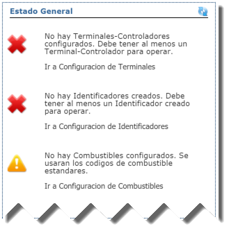
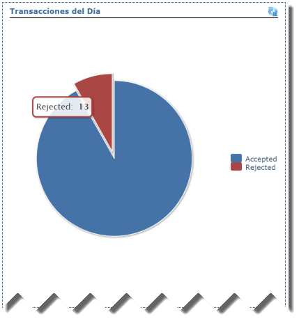
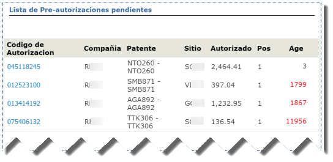
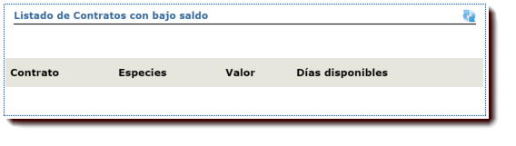
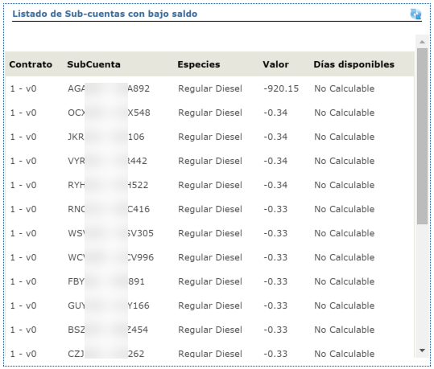
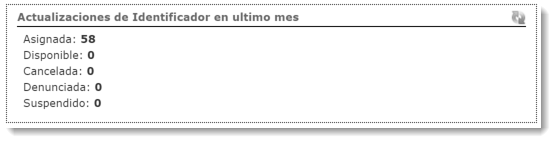
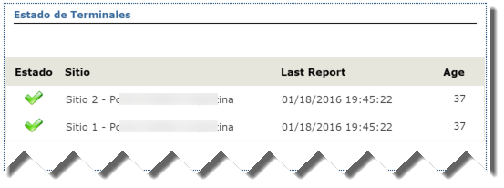
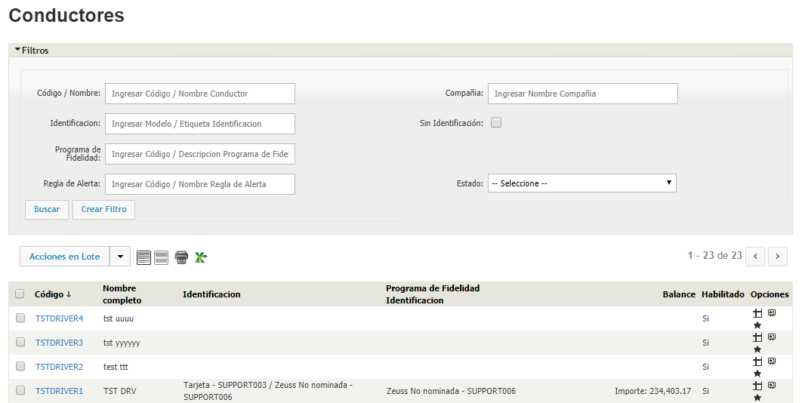

# ATIONet - Manual de Usuario Network (Suscripción tipo Network)

<table>
	<tr>
		<th colspan="2" align="left">Información documento</th>
	</tr>
	<tr>
		<td>Archivo:</td>
		<td>AN-Network-UserManal-SP</td>
	</tr>
	<tr>
		<td>Version documento:</td>
		<td>1.0</td>
	</tr>
	<tr>
		<td>Fecha:</td>
		<td>2 Agosto 2017</td>
	</tr>
	<tr>
		<td>Autor:</td>
		<td>ATIO International LLC</td>
	</tr>
</table>

<table>
	<tr>
		<th colspan="3" align="left">Change Log</th>
	</tr>
	<tr>
		<td>Ver.</td>
		<td>Fecha</td>
		<td>Detalle cambio</td>
	</tr>
	<tr valign="top">
		<td>1.0</td>
		<td>2 Agosto 2017</td>
		<td>Version inicial.</td>
	</tr>
</table>

## Contents

<!-- MarkdownTOC depth=3 -->

- Visión general
- [Definiciones](#definiciones)
	- [Contrato](#contrato) 
	- [Sub cuenta](#sub-cuenta)
	- [Compañía](#compañía)
	- [Identificador](#identificador)
	- [Sitio](#sitio)
	- [Vehículo](#vehículo)
	- [Conductor](#conductor)
	- [Modulo offline](#modulo-offline)
- [Menú de Navegación](#menú-de-navegación)
	- [Tablero](#tablero)
		- [Estado General](#estado-general)
		- [Litros-Mes](#litros-mes)
		- [Transacciones del Día](#transacciones-del-día)
		- [Lista de Pre-Autorizaciones Pendientes](#lista-de-pre-autorizaciones-pendientes)
		- [Transacciones marcadas en ultimo mes](#transacciones-marcadas-en-ultimo-mes)
		- [Instalaciones](#instalaciones)
		- [Sub-cuentas con excepciones](#sub-cuentas-con-excepciones)
		- [Actualizaciones de Identificador en ultimo mes](#actualizaciones-de-identificador-en-ultimo-mes)
		- [Transacciones recientes](#transacciones-recientes)
		- [Listado de Sub-cuentas con bajo saldo](#listado-de-sub-cuentas-con-bajo-saldo)
		- [Estado de Terminales](#estado-de-terminales)
		- [Contratos sin actividad](#contratos-sin-actividad)
		- [Listado de contratos con bajo saldo](#listado-de-contratos-con-bajo-saldo)
	- [Favoritos](#favoritos)	
	- [Vistas](#vistas)
		- [Autorizaciones Pendientes](#autorizaciones-pendientes)
		- [Conductores](#conductores)
		- [Cuentas corrientes de Comercio](#cuentas-corrientes-de-comercio)
		- [Cuentas corrientes de Compañia](#cuentas-corrientes-de-compañía)
		- [Transacciones](#transacciones)
		- Transacciones por Conductor
		- Transacciones por Flota
		- Transacciones por Sitio
		- Transacciones por Vehículo
		- [Transacciones Rechazadas](#transacciones-rechazadas)
		- [Transacciones sin Control](#transacciones-sin-control)
		- [Vehiculos](#vehiculos)
	- [Reportes](#reportes)
		- [Conductor](#conductor)
		- [Transacciones](#transacciones)
		- [Vehiculo](#vehiculos)
	- Inventario
		- Grafico de Inventarios
		- Inventario
		- Recepciones
		- Reconciliazión Inventario 
	- [Administración](#administración)
		- [Categorías de SKUs](#categorías-de-skus)
		- [Comercios](#comercios)
		- [Compañias](#compañias)
		- [Conceptos](#conceptos)
		- [Configuración de Fast Track](#configuración-de-fast-track)
		- [Contingencia](#contingencia)
		- [Contratos de Comercios](#contratos-de-comercios)
		- [Contratos de Compañias](#contratos-de-compañias)
		- [Cuentas corrientes de Comercio](#cuentas-corrientes-de-comercio)
		- [Cuentas corrientes de Compañia](#cuentas-corrientes-de-compañia)
		- [Depositos](#depositos)
		- [Familias de Conceptos](#familias-de-conceptos)
		- [Identificaciones Solicitadas](#identificaciones-solicitadas)
		- [Identificadores](#identificadores)
		- [Impuestos](#impuestos)
		- [Instalaciones](#instalaciones)
		- [Métodos de Pago](#metodos-de-pago)
		- [Modelos de Identificador](#modelos-de-identificador)
		- [Programas](#programas)
		- [Sitios](#sitios)
		- [SKUs](#skus)
		- [Tarjeta de Regalo](#tarjeta-de-regalo)
		- [Tarjetas de Regalo Solicitadas](#tarjetas-de-regalo-solicitadas)
		- [Transacciones Desconocidas](#transacciones-desconocidas)
		- [Usuarios](#usuarios)
- [Mis Filtros](#mis-filtros)
- [Solución de Problemas](#solucion-de-problemas)
- [Mis Preferencias](#mis-preferencias)
- [Configuración Nano CPI para ATIONet](#configuración-nano-cpi-para-ationet)

<!-- /MarkdownTOC -->

ATIOnet se basa en la premisa de que las comunicaciones online entre sitios y el portal web son posibles, sin embargo, provee solidos procedimientos de contingencia en el caso de que ocurra un error de comunicacion.

La plataforma de ATIOnet es un servicio de administracion de flotas con una innovadora y unica oferta de mercado. Procesamiento en la nube, 100% web-based, acceso multi-usuario, disponibilidad y compartimiento de datos, actualizaciones instantaneas, seguridad, back-up automatico y reduccion de papeleo.

ATIOnet es un portal web para companias de servicios de flotas que permite el procesamiento de transacciones desde cualquier aplicacion de punto de venta mediante una interfaz simple y confiable. 

ATIOnet puede ser instalado en cualquier estacion de servicio con uno o multiples programas de servicios de flotas. El portal web le permite a los administradores de flotas acceso total a la informacion de sus vehiculos.

ATIOnet hace posible que el administrador de flota opere, monitoree, cambie y edite la informacion de la flota en tiempo real.

## Visión General

Lorem ipsum dolor sit amet, consectetur adipiscing elit. Vivamus mollis quam ac ligula maximus, vitae dictum lorem consequat. Curabitur interdum pretium cursus. Vestibulum pharetra sodales enim, ut vestibulum dui semper quis. Aliquam convallis nulla eu neque vestibulum eleifend. Nam feugiat leo a bibendum rutrum. Duis quis augue et dui vulputate rhoncus. Sed vitae felis fringilla, lacinia est vel, imperdiet leo. Sed suscipit neque risus, eu pharetra dolor rhoncus ac.

## Definiciones

### Contrato 

El contrato es la relacion que existe entre la network y el cliente, en el que se pauta, por ejemplo, si sera de importe o volumen, el precio al que se le va a vender el combustible, en que sitios puede cargar, entre otros.

### Sub Cuenta 

Cada vez que se asocia un identificador a un vehículo o un conductor se crea una sub cuenta. La sub cuenta es en definitiva quien va a tener una cuenta corriente, la sub cuenta va a poder recibir depósitos de dinero o producto. Las reglas también impactan a la sub cuenta.

Las sub cuentas dependen jerarquicamente del contrato.

### Compañía 

En ATIOnet, la compañia se refiere a la empresa dueña de la flota.

### Identificador 

El identificador es el medio físico que utiliza ATIONet para poder identificar un vehículo o un conductor. ATIONet soporte varios tipos de identificaciones, como ser tarjeta, tag (anillo), chip, tarjeta ATIONet, entrada manual, código de barras e iButton. Cuando se asocia un identificador a un Vehículo o Conductor se crea una sub cuenta.

### Sitio 

El Sitio representa a la estación de servicio. A un sitio se le asigna la terminal y también puede tener asociadas reglas de Ubicación.

### Vehículo 

Los vehículos pueden ser asociados o agrupados por una flota, pueden tener reglas asociadas y al momento de ser relacionados con un identificador se crea una sub cuenta. También pueden tener un conductor asociado.

### Conductor 

El Conductor es la persona que esta identificado en ATIONet como un conductor. Si a este conductor se le asigna un identificador, se crea una sub cuenta. Los conductores también pueden tener reglas asociadas.

### Modulo Offline 

El modulo offline de ATIONet se activa automáticamente cuando la estación de servicio se queda sin conexión a internet y las autorizaciones no se pueden procesar online. En este momento entra en juego el modulo offline. Para el controlador Nano CPI es totalmente transparente. Cuando el modulo offline recupera la conectividad envía toda la información procesada localmente y también baja las novedades. Mientras haya conectividad el modulo offline esta continuamente bajando las novedades (saldos, identificadores, reglas, etc) de ATIONet.

### Terminal 

La terminal (o controlador) es la representación del controlador de surtidores, que necesita parametrizarse de manera particular según el tipo de terminal. Las terminales que ATIONet maneja son ATIO-NanoCPI, ATIO-Standalone, ATIO-CG, VF-Standalone, VF-Sapphire, VF-Ruby, ControlGas y OPW-FSC3000. 

## Menú de Navegación

Ationet posee un menú de acceso rápido ubicado en la parte izquierda de la pagina. Desde este menú usted podrá acceder a las distintas opciones. el menú esta dividido en 7 secciones. (Tablero, Favoritos, Vistas, Reportes, Inventario, Administración y Bitácora)

### Tablero

El Tablero es una pagina donde usted tendrá una visión global de la operación de su red. El tablero posee widgets específicos que lo ayudaran a tomar decisiones preventiva o correctivas según la información y los datos que muestren. Los datos que se muestran en el Tablero, son datos en tiempo real. Algunos de los widgets se refrescan automáticamente.
Estos se pueden quitar o agregar según las necesidades del usuario en la ventana mis preferencias. También se pueden acomodar en el tablero según el nivel de visibilidad que le quiera dar a cada uno.
La lista completa de widgets disponibles para las suscripciones "Network" es la siguiente:

#### Estado General ####

Este widget es de suma importancia al poner en marcha la red. Este widget nos da información de que parámetros necesitamos configurar para quedar operativos. Nos advierte cuando por ejemplo no tenemos vehículos o identificaciones creadas entre otros parámetros.
Este widget puede mostrar "Advertencias" (ícono amarillo) cuando no esta en juego la operación de la red, pero si muestra una cruz roja indica que la red no esta operativa. 

#### Litros-Mes

El de "Litros/Mes indica la cantidad que se despachó de cada combustible en el ultimo mes. Como ultimo mes se entiende a los últimos 30 días contando desde el día de la fecha. Este widget posee la capacidad de filtrar por Sitio, Ciudad y Flota. Se debe seleccionar el filtro y después se ingresa el valor por el cual se debe filtrar. Este ultimo campo es del tipo "auto complete".

#### Transacciones del Día

Este widget contiene un gráfico de torta que en forma muy rápida se pueden ver cuantas transacciones se aprobaron y cuantas se rechazaron en el día.

#### Lista de Pre-Autorizaciones Pendientes

Este widget del tipo lista, muestra todas las pre autorizaciones que todavía no recibieron la transacción de finalización. (para mas detalles sobre el flujo de transacciones consulte este [documento](AN-Transaction_Flows-TechGuide.md)).
Este muestra 7 columnas:

1. ***Código de Autorización:*** El código de autorización asignado a la transacción
2. ***Compañía:*** La compañía a la que pertenece el vehículo en cuestión
3. ***Patente:*** La patente del vehículo
4. ***Sitio:*** El sitio donde se llevo a cabo la transacción
5. ***Autorizado:*** El monto que fue autorizado en la pre autorización
6. ***Pos:*** Posición o bomba informada por el punto de venta o controlador
7. ***Age:*** El tiempo en minutos que lleva vigente esa pre autorización

Las pre autorizaciones pendientes deberían ser despachos en curso, si hay registros en este widget con un Age alto, significa que el punto de venta o controlador no enviaron la transacción de finalización o la transacción de cancelación en el caso que no se haya despachado combustible.

#### Transacciones marcadas en ultimo mes

El siguiente muestra todas las transacciones que fueron rechazadas por cualquiera de las validaciones que hace Ationet en el proceso de autorización. Ya sean por falta de saldo o reglas entre otras validaciones. Para mas detalles sobre "Transacciones Rechazadas" consulte este documento: [TODO](#todo) 

#### Contratos sin actividad

Muestra la lista de contratos que nunca tuvieron actividad.

#### Sub-cuentas con excepciones

Este muestra todas las sub cuentas que tengan algo que prestarle atención, como por ejemplo:

1. ***Sin Identificadores:*** Son los vehículos o conductores que no tienen un identificador asociado.
2. ***Con Identificadores inactivos:*** Son subcuentas que que tienen un identificador asociado que ha sido desactivado desde el portal.
3. ***Con Identificadores suspendidos:*** Son subcuentas que que tienen un identificador que ha sido suspendido. ***Solo Ationet puede suspender un identificador***.
4. ***Con conductores o vehículos inactivos:*** Son subcuentas que que tienen un vehículo o conductor que no ha sido desactivado desde el portal.

Para mas detalles sobre sub cuentas consulte: [Esta sección](#sub-cuenta)

#### Transacciones recientes

El siguiente muestra las ultimas 20 transacciones finalizadas. Se muestran los datos mas relevantes para poder identificarla, en el caso de necesitar mas información sobre la transacción se puede hacer click sobre el código de autorización, eso lo llevara a la vista de detalles de la transacción.

#### Listado de contratos con bajo saldo

Muestra la lista de contratos que contengan bajo saldo para operar 4 días mas. Este calculo se hace en base al uso. La columna "Días disponibles" muestra cantidad de días que le quedan al contrato basada en el análisis de uso. Este numero no es exacto y podría variar si el patrón de uso cambia.

#### Listado de Sub-cuentas con bajo saldo

Muestra la lista de sub cuentas que contengan bajo saldo para operar 4 días mas. Este calculo se hace en base al uso de cada sub cuenta. La columna "Días disponibles" muestra cantidad de días que le quedan a la sub cuenta basada en el análisis de uso. Este numero no es exacto y podría variar si el patrón de uso cambia.

#### Actualizaciones de Identificador en ultimo mes

Este widget muestra la actividad de la administración de los identificadores, muestra la cantidad de identificadores que fueron modificados agrupado por estado.

1. ***Asignada:*** La cantidad de identificadores que cambiaron al estado "Asignada".
2. ***Disponible:*** La cantidad de identificadores que cambiaron al estado "Disponible".
3. ***Cancelada:*** La cantidad de identificadores que cambiaron al estado "Cancelada".
4. ***Denunciada:*** La cantidad de identificadores que cambiaron al estado "Denunciada".
5. ***Suspendida:*** La cantidad de identificadores que cambiaron al estado "Suspendida".

#### Estado de Terminales

Todas las terminales que estén conectadas en forma nativa a ATIONet, envían en forma regular un mensaje indicando que están activas. Si la terminal reporto el estado en las ultimas 5 horas, la terminal se mostrara con el ícono verde, sino se reporto en las ultimas 5 horas el ícono sera rojo.
La columna ***"Age"*** muestra la cantidad de minutos que pasaron desde la ultima vez que se reporta la terminal. 

### Favoritos

Las entidades Vehículos, Conductores, Sitios y Flotas son entidades que podrían requerir un control diario por parte de ciertos usuarios. Para facilitar esta tarea usted puede agregar alguna de estas entidades a la lista de Favoritos. Una vez ingresada una entidad a esta lista el acceso es mas rápido y directo, sin necesidad de ingresar filtros cada vez que la desea buscar. 

Una vez dentro de la pagina de Favoritos, al hacer click sobre el link de la columna "Tipo", usted sera redireccionado a la vista detallada de esa entidad. 

Si desea remover una entidad de la lista de Favoritos, haga click sobre el ícono de la derecha con forma de cruz.

### Vistas

ATIONet dispone de una serie de vistas donde se puede visualizar información de la operación de la red. ATIONet considera una vista a toda aquella pantalla que ademas de poder visualizar información, también es exportable para un post procesamiento. A diferencia de los [***Reportes***](#reportes) que son pantallas que muestran información con un formato pensado para ser impreso y guardado.
Todas las vistas en ATIONet respetan una consistencia en estética y funcionalidad. Todas las vistas poseen una barra de herramientas con todas estas funciones (o al menos alguna de ellas)

 

1. ***Vista Condensada:*** Esta opción viene activa de defecto cuando se abre la vista, esta opción muestra en la grilla los datos mínimos en un solo renglón.
2. ***Vista Detallada:*** Esta opción activa un segundo renglón en cada registro dentro de la grilla y muestra mas información de cada uno de los registros.
3. ***Imprimir:*** Al hacer click en esta opción, se abre una nueva ventana con los datos mostrados en la grilla pero con un formato orientado a ser impreso, se incluye una cabecera con el logo que el subscriptor configuro.
4. ***Exportar:*** Al hacer click en esta opción la información mostrada en ese momento en la grilla es exportada a Excel. Se iniciara una descarga automática en su navegador.
5. ***Actualizar:*** Algunas vistas donde la frecuencia de cambio de información es alta, podría ser de utilidad querer refrescar la grilla. Esta opción refresca los datos en forma inmediata.  

Algunas vistas también poseen un panel de filtros. Por defecto este panel aparece colapsado, para desplegarlo haga click en la barra que dice "Filtros". Cada vista posee campos específicos por los cuales se puede filtrar. Una vez que haya ingresado los valores deseados presione el botón "Buscar".

Las vistas también poseen paginación y el usuario podrá definir cuantos registros por pagina se muestran. Esta configuración se realiza desde [***Mis Preferencias***](#mis-preferencias)
La siguiente es la vista de Vehículos de ATIONet:

#### Autorizaciones Pendientes

Las autorizaciones pendientes son aquellas transacciones que todavía no recibieron la transacción de finalización. Los registros que se ven en esta vista son despachos que se están llevando a cabo en este momento. Si por alguna razón existen pre autorizaciones viejas, es probable que el POS no haya enviado la transacción de finalización o la de cancelación si el despacho no fue realizado.

Tenga en cuenta que al momento de pre autorizar, ATIONet congelo el monto de la autorización de la cuenta corriente de la sub cuenta.
Esta vista presenta todos los campos necesarios para poder identificar la transacción y el vehículo. Si necesita ver mas detalles, al hacer click en el código de autorización lo llevara a la vista de detalles de la transacción.

Si aparecen transacciones pendientes viejas y usted esta seguro que no es un despacho en curso, puede cancelarlas y devolver el saldo a la cuenta corriente.
Para hacer esto tiene 2 maneras, en forma individual, haciendo click en el ícono de la "X" a la derecha de la grilla o en forma masiva seleccionando las transacciones, desplegar el menú "Acciones en Lote" y seleccionar "Cancelar". Esto cancelara las transacciones y devolverá el saldo a cada una de las cuentas corrientes.

(para más detalles sobre el flujo de transacciones consulte este [documento](AN-Transaction_Flows-TechGuide.md))

#### Conductores

En esta vista se listan los conductores que han sido dados de alta. Puede filtrarlos por nombre, identificacion, compañia, regla de alerta o estatus. Tambien, en la columna de opciones que se encuentra a la derecha, puede elegir asignar una identificacion, editarla o marcar al conductor como favorito.

#### Cuentas corrientes de Comercio

La vista de Cuentas corrientes de comercio es la vista donde se consultan los balances y movimientos de los comercios.
En ATIONet el termino comercio se refiere a la empresa dueña de los sitios.

Esta vista posee al igual que el resto de las vistas un panel de filtros.
La primer opción en el panel es el tipo de reporte que queremos ver.

#### Cuentas corrientes de Compañía

La vista de Cuentas corrientes de compañía es la vista en donde se consultan los saldos disponibles de las sub cuentas (Recuerde que la sub cuenta es la unión entre un vehículo/conductor y un identificador. Para mas detalles sobre sub cuentas consulte: [Esta sección](#sub-cuenta)).
En ATIONet el termino compañía se refiere a la empresa dueña de la flota. Para mas detalles sobre compañías consulte: [Esta sección](#compañía)

Esta vista posee al igual que el resto de las vistas un panel de filtros.
La primer opción en el panel de filtros es el tipo de reporte que queremos ver:

1. ***Lista de Contratos:*** Esta opción lista los contratos con su respectivo saldo, pero no da detalles de los movimientos, es una vista que resume los datos de cada una de las subcuentas.

	

2. ***Movimientos de Contratos:*** Esta opción lista las subcuentas con su respectivo saldo, pero no da detalles de los movimientos, es una vista que resume los datos de cada una de las subcuentas.

	

3. ***Lista de Sub-cuentas:*** Esta opción lista las subcuentas con su respectivo saldo, pero no da detalles de los movimientos, es una vista que resume los datos de cada una de las subcuentas.

	

4. ***Movimientos de Sub-cuentas:*** Esta opción de la vista muestra en detalle cada uno de los movimientos de la subcuenta, tanto los créditos como los débitos.   

	

Al seleccionar esta segunda opción se habilitan varios filtros mas:

* ***Estado de Cuenta:*** Numero del extracto de cuenta.
* ***Subcuenta:*** Ingresando uno o varios nombres de subcuenta, solo se listarán los movimientos de esas subcuentas. Tenga en cuenta que este campo es "autocomplete", se completara a medida que escribe, si presiona la barra espaciadora mostrara todas las subcuentas.
* ***Fecha Desde / Fecha Hasta:*** Ingresando estos valores, filtrara los movimientos entre ambas fechas.
* ***Hora Desde / Hora Hasta:*** Ingresando estos valores, filtrara los movimientos entre ambas horas.
* ***Monto Desde / Monto Hasta:*** Ingresando estos valores filtrara, los movimientos cuyo monto este entre ambos valores.
* ***Especies:*** Se puede filtrar por la especie (Producto).
* ***Débito / Crédito:*** Se puede seleccionar que tipo de movimientos se desean ver, si los de débito o los de crédito.
* ***Tipo:*** Que tipo de movimiento genero el movimiento en la cuenta corriente
* ***Origen:*** Origen del movimiento, ya sea la consola de ATIONet, una aplicación móvil o una llamada a la API desde una aplicación de terceros.
* ***Movimientos Transitorios:*** Tildando esta opción se mostraran los movimientos internos que genera ATIONet. Por ejemplo cada vez que se congela saldo después de una pre autorización y se recibe una transacción de finalización, ATIONet devuelve el saldo congelado y posteriormente debita el monto final informado. La devolución del saldo congelado es considerado un movimiento transitorio y no se muestran si esta opción no esta seleccionada.

#### Excepciones

ATIONet separa las transacciones no autorizadas en 2 secciones, las Excepciones y las [Transacciones Rechazadas](#transacciones-rechazadas).
Las Excepciones son aquellas transacciones que no llegaron a pasar las validaciones duras del sistema o las que se detectan como posibles fraudes.

En la vista de Excepciones podemos filtrar por el tipo de Excepción primero. Los tipo de Excepciones disponibles son los siguientes:

Esta vista también posee el panel de filtros mencionada anteriormente. Vale la pena resaltar el filtro  ***"Transacciones Off-line"***, al tildar esta opción, también se mostraran aquellas transacciones que fueron marcadas como Excepciones en el modulo Offline. 
(para mas detalles sobre el modulo Offline consulte esta [sección](#modulo-offline))

Una vez que seleccionó los filtros, presione ***"Buscar"*** y se listarán todas las transacciones marcadas como Excepciones.

Algunas transacciones quedan en estado "Revisión" bajo algunas situaciones, como por ejemplo cuando se despacha más de lo autorizado (por un error en el controlador o el POS). En estos casos es necesario aprobar o rechazar la transacción mediante uno de los 2 íconos a la derecha de cada registro.

#### Transacciones

La vista de transacciones es una de las mas importantes en ATIONet. en esta vista se ven las transacciones que se realizaron y fueron aprobadas.

El panel de Filtros posee todos estas posibilidades:

* ***Cod. Autoriz.:*** Código de Autorización entregado por ATIONet.
* ***Vehículo:*** Vehículo o Vehículos (campo autocomplete y de selección múltiple, presionando la barra espaciadora listara los primeros 20 vehículos).
* ***Flota:*** El nombre de la flota. (campo autocomplete y de selección múltiple)
* ***Sitio:*** El nombre del sitio. (campo autocomplete y de selección múltiple)
* ***Fecha Desde / Fecha Hasta:*** Rango de fechas.
* ***Hora Desde / Hora Hasta:*** Rango de horas.
* ***Rendimiento por Periodo:*** [TODO]
* ***Transacciones Off-line:*** Tildando esta opción también se listaran las transacciones aprobadas en modo Offline. (para mas detalles sobre el modulo Offline consulte esta [sección](#modulo-offline))
* ***Turno:*** El turno en el que ocurrió la transacción. (siempre y cuando la terminal o el POS lo informen)
* ***Conductor:*** El nombre del conductor. (campo autocomplete y de selección múltiple).
* ***Terminal / Controlador:*** Nombre de la terminal que registro la transacción. (campo autocomplete y de selección múltiple).
* ***Combustible:*** El producto que intervino en la transacción. (campo autocomplete y de selección múltiple)
* ***Mostrar Transacciones Completas en Cero:*** Tildando esta opción también mostrara las transacciones que se hayan enviado con monto o volumen en 0.
* ***Transacciones con Producto:*** Tildando esta opción también se mostraran transacciones que contengan productos secos.

Una vez seleccionado el filtro deseado se presiona ***"Buscar"*** y listara las transacciones que cumplan con el filtro.

En la grilla se muestran los datos principales de la transacción, en la columna acciones se puede desconocer una transacción y entrara en el proceso de desconocimiento. (para mas detalles sobre el desconocimiento de transacciones consulte esta [sección](#transacciones-desconocidas)).

Si desea ver el detalle de la transacción, haga click en el Código de Autorización, esto lo llevará a una vista con el detalle de la transacción.

 

#### Transacciones por Conductor

En esta vista se pueden ver las transacciones, agrupadas por  el conductor que la realizó. Los botones que estan colocados en la parte superior izquierda son para imprimir la tabla o crear un archivo Excel de la tabla, respectivamente.

El panel de filtros posee las siguientes posibilidades:

* ***Agrupar por:***  Sitio, Flota, Programa, Id Vehículo y/o Fecha.
* ***Conductor:*** Filtrar por el conductor que despachó.
* ***Flota:*** Filtrar por flota a la cual pertenece el vehículo que realizó el despachó.
* ***Id Vehículo:*** Filtrar por el Id del vehículo que realizó el despachó.
* ***Sitio:*** Filtrar por sitio donde se realizó el despacho.
* ***Terminal/Controlador:*** Filtrar por terminal/controlador que despachó.
* ***Combustible:*** Filtrar por el combustible que se despachó.
* ***Fecha desde/Fecha hasta:*** Rango de fechas a filtrar.
* ***Hora desde/Hora hasta:*** Rango de horas a filtrar.

Cuando termine de llenar el formulario, cliquée "Buscar" para aplicar el filtro, o "Crear filtro" para guardar el filtro hecho.

#### Transacciones por Flota

En esta vista se pueden ver las transacciones que se realizaron, agrupadas por flota. Los botones que estan colocados en la parte superior izquierda son para imprimir la tabla o crear un archivo Excel de la tabla, respectivamente.

El panel de filtros posee las siguientes posibilidades:

* ***Agrupar por:***  Sitio, Vehículo, Id Conductor y/o Fecha.
* ***Flota:*** Filtrar por flota a la cual pertenece el vehículo que realizó el despacho.
* ***Vehículo:*** Filtrar por el vehículo que realizó el despacho.
* ***Id Conductor:*** Filtrar por el Id del conductor que realizó el despacho.
* ***Sitio:*** Filtrar por sitio donde se realizó el despacho.
* ***Combustible:*** Filtrar por el combustible que se despachó.
* ***Terminal/Controlador:*** Filtrar por terminal/controlador que despachó.
* ***Fecha desde/Fecha hasta:*** Rango de fechas a filtrar.
* ***Hora desde/Hora hasta:*** Rango de horas a filtrar.

Cuando termine de llenar el formulario, cliquee "Buscar" para aplicar el filtro, o "Crear filtro" para guardar el filtro hecho.

#### Transacciones por Sitio

En esta vista se pueden ver las transacciones que se realizaron, agrupadas por  el sitio donde ocurrieron. Los botones que estan colocados en la parte superior izquierda son para imprimir la tabla o crear un archivo Excel de la tabla, respectivamente.

El panel de filtros posee las siguientes posibilidades:

* ***Agrupar por:***  Combustible, Flota, Programa, Turno y/o Fecha.
* ***Sitio:*** Filtrar por sitio donde se realizó el despacho.
* ***Combustible:*** Filtrar por el combustible que se despachó.
* ***Flota:*** Filtrar por flota a la cual pertenece el vehículo que realizó el despacho.
* ***Terminal/Controlador:*** Filtrar por terminal/controlador que despachó.
* ***Fecha desde/Fecha hasta:*** Rango de fechas a filtrar.
* ***Hora desde/Hora hasta:*** Rango de horas a filtrar.

Cuando termine de llenar el formulario, cliquee "Buscar" para aplicar el filtro, o "Crear filtro" para guardar el filtro hecho.

#### Transacciones por Vehículo

En esta vista se pueden ver las transacciones, agrupadas por el vehículo que las realizó. Los botones que estan colocados en la parte superior izquierda son para imprimir la tabla o crear un archivo Excel de la tabla, respectivamente.

El panel de filtros posee las siguientes posibilidades:

* ***Agrupar por:***  Sitio, Flota, Programa, Id Conductor y/o Fecha.
* ***Vehículo:*** Filtrar por vehículo que realizó el despacho.
* ***Flota:*** Filtrar por flota a la cual pertenece el vehículo que realizó el despacho.
* ***Id Conductor:*** Filtrar por el Id del conductor que realizó el despacho.
* ***Sitio:*** Filtrar por sitio donde se realizó el despacho.
* ***Terminal/Controlador:*** Filtrar por terminal/controlador que despachó.
* ***Combustible:*** Filtrar por el combustible que se despachó.
* ***Fecha desde/Fecha hasta:*** Rango de fechas a filtrar.
* ***Hora desde/Hora hasta:*** Rango de horas a filtrar.

Cuando termine de llenar el formulario, cliquee "Buscar" para aplicar el filtro, o "Crear filtro" para guardar el filtro hecho.

#### Transacciones Rechazadas

ATIONet separa las transacciones NO autorizadas en 2 secciones, las [Excepciones](#excepciones) y las Transacciones Rechazadas.
Las Transacciones Rechazadas son aquellas transacciones que lograron pasar las validaciones duras de ATIONet pero fueron rechazadas por otras validaciones como ser alguna regla no satisfecha o validación de saldo.

En la vista de Transacciones Rechazadas podemos filtrar por el tipo de rechazo primero. Los tipo de rechazos disponibles son los siguientes:

Esta vista también posee el panel de filtros mencionada anteriormente. Vale la pena resaltar el filtro  ***"Transacciones Off-line"***, al tildar esta opción, también se mostraran aquellas transacciones que fueron marcadas como rechazadas en el modulo Offline. 
(para mas detalles sobre el modulo Offline consulte esta [sección](#modulo-offline))

Una vez que selecciono los filtros, presiona ***"Buscar"*** y se listaran todas las transacciones marcadas como rechazadas.

Cabe aclarar que existe la posibilidad de que una transacción sea rechazada pero que el combustible haya sido entregado. Esto ocurre cuando el rechazo se produce en la transacción de terminación.
Algunos de los motivos mas comunes de esta situación los los siguientes:

* La pre autorización esta vencida (mas de 3hs entre la fecha de creación de la pre autorización y la fecha de creación de la terminación. Esto no se relaciona con el tiempo que puede tardar en llegar la terminación en modo offline).
* No existe una pre autorización existente para esa transacción.
* La pre autorización fue cancelada manualmente.
* La transacción de terminación contiene información invalida (errores en la terminal o controlador).
* La transacción de terminación se ejecuto con errores en el host.
* La transacción de terminación contiene información diferente a la de pre autorización, como por ejemplo.
* La transacción de terminación informa mas volumen o importe que el que fue autorizado. En este caso se puede aprobar la autorización.

#### Transacciones sin Control

Las transacciones sin control son aquellas transacciones que se generan porque el controlador detecto una diferencia de aforadores y envía una transacción por la diferencia. Estas transacciones no contienen datos sobre el identificador ya que fueron generadas automáticamente y no se iniciaron con la presentación de un identificador. Al no tener un identificador asignado tampoco se impactan en ninguna cuenta corriente ni cuentan para calculo de reglas.
Esta vista también el panel de filtros para hacer búsquedas mas especificas.

#### Vehículos

En esta vista se listan los vehículos que han sido dados de alta. Recuerde que no es obligatorio cargar vehículos para poder operar, solo es necesario si usted decide asociar los identificadores a vehículos.

Esta vista posee  el panel de filtros para poder especificar mas la búsqueda. Cabe destacar el filtro "Sin Identificación", seleccionando esta opción, se mostraran solo aquellos vehículos que no han sido asignados a un identificador. 

Para ver mas detalles del vehículo, haga click en el código:

### Reportes

En ATIONet los reportes son considerados aquellos listados de información que si o si van a ser impresos y archivados en formato físico. Al ser impresos ATIONet les agrega una cabecera con el logo de la suscripción automáticamente.

#### Conductor

El reporte de Conductor se puede filtrar por nombre / código de conductor o por identificación.
Una vez seleccionado el filtro se presiona el botón ***Imprimir***, esto desplegará un popup con la información seleccionada.
La información es mostrada con un formato listo para ser impreso, incluyendo el logo de la suscripción y la fecha y la hora de generación del reporte.

Este popup posee un botón imprimir que al apretarlo se abre la ventana de impresión por defecto del navegador de internet.

#### Transacciones

Este reporte muestra la lista de transacciones realizadas, ordenadas por fecha. Este reporte posee varios filtros para ajustar la busqueda. El primer campo del panel de filtros  indica porque campo se va a ordenar la lista, el campo seleccionado en esta lista sera mostrado en la primer columna.

Una vez seleccionado el filtro se presiona el botón ***Imprimir***, esto desplegara un popup con la información seleccionada.
La información es mostrada con un formato listo para ser impreso, incluyendo el logo de la suscripción y la fecha y la hora de generación del reporte.

Este popup posee un botón imprimir que al apretarlo se abre la ventana de impresión por defecto del navegador de internet.

#### Vehículo

Este reporte muestra la lista de vehículos. Este reporte posee varios filtros para ajustar la búsqueda. El primer campo del panel de filtros  indica porque campo se va a ordenar la lista, el campo seleccionado en esta lista sera mostrado en la primer columna.

Una vez seleccionado el filtro se presiona el botón ***Imprimir***, esto desplegará un popup con la información seleccionada.
La información es mostrada con un formato listo para ser impreso, incluyendo el logo de la suscripción y la fecha y la hora de generación del reporte.

Este popup posee un botón imprimir que al apretarlo se abre la ventana de impresión por defecto del navegador de internet.

### Administración
 
#### Categorías de SKUs

Lorem ipsum dolor sit amet, consectetur adipiscing elit. Vivamus mollis quam ac ligula maximus, vitae dictum lorem consequat. Curabitur interdum pretium cursus. Vestibulum pharetra sodales enim, ut vestibulum dui semper quis. Aliquam convallis nulla eu neque vestibulum eleifend. Nam feugiat leo a bibendum rutrum. Duis quis augue et dui vulputate rhoncus. Sed vitae felis fringilla, lacinia est vel, imperdiet leo. Sed suscipit neque risus, eu pharetra dolor rhoncus ac.

#### Comercios

En ATIOnet el termino comercio se refiere a la empresa dueña de los sitios. En esta sección puede ver los comercios existentes con sus detalles y editarlas si quiere.

#### Compañias

En ATIOnet el termino compañía se refiere a la empresa dueña de la flota. En esta sección puede ver las compañias existentes con sus detalles y editarlas si quiere. Tambien puede filtrarlas por nombre y/o codigo.

#### Conceptos

Lorem ipsum dolor sit amet, consectetur adipiscing elit. Vivamus mollis quam ac ligula maximus, vitae dictum lorem consequat. Curabitur interdum pretium cursus. Vestibulum pharetra sodales enim, ut vestibulum dui semper quis. Aliquam convallis nulla eu neque vestibulum eleifend. Nam feugiat leo a bibendum rutrum. Duis quis augue et dui vulputate rhoncus. Sed vitae felis fringilla, lacinia est vel, imperdiet leo. Sed suscipit neque risus, eu pharetra dolor rhoncus ac.

#### Configuración de Fast Track

Lorem ipsum dolor sit amet, consectetur adipiscing elit. Vivamus mollis quam ac ligula maximus, vitae dictum lorem consequat. Curabitur interdum pretium cursus. Vestibulum pharetra sodales enim, ut vestibulum dui semper quis. Aliquam convallis nulla eu neque vestibulum eleifend. Nam feugiat leo a bibendum rutrum. Duis quis augue et dui vulputate rhoncus. Sed vitae felis fringilla, lacinia est vel, imperdiet leo. Sed suscipit neque risus, eu pharetra dolor rhoncus ac.

#### Contingencia

Lorem ipsum dolor sit amet, consectetur adipiscing elit. Vivamus mollis quam ac ligula maximus, vitae dictum lorem consequat. Curabitur interdum pretium cursus. Vestibulum pharetra sodales enim, ut vestibulum dui semper quis. Aliquam convallis nulla eu neque vestibulum eleifend. Nam feugiat leo a bibendum rutrum. Duis quis augue et dui vulputate rhoncus. Sed vitae felis fringilla, lacinia est vel, imperdiet leo. Sed suscipit neque risus, eu pharetra dolor rhoncus ac.

#### Contratos de Comercios

En ATIONet el termino comercio se refiere a la empresa dueña de los sitios. En esta sección usted puede consultar los contratos.

#### Contratos de Compañía

En ATIONet el termino compañía se refiere a la empresa dueña de la flota. En esta sección usted puede consultar los contratos. 

Para hacer las consultas mas faciles existe una ventana de filtros aplicables. Puede filtrar por el código, la compañia, el modo (credito o debito), la descripción o especies.

#### Cuentas corrientes de Comercio

Lorem ipsum dolor sit amet, consectetur adipiscing elit. Vivamus mollis quam ac ligula maximus, vitae dictum lorem consequat. Curabitur interdum pretium cursus. Vestibulum pharetra sodales enim, ut vestibulum dui semper quis. Aliquam convallis nulla eu neque vestibulum eleifend. Nam feugiat leo a bibendum rutrum. Duis quis augue et dui vulputate rhoncus. Sed vitae felis fringilla, lacinia est vel, imperdiet leo. Sed suscipit neque risus, eu pharetra dolor rhoncus ac.

#### Cuentas corrientes de Compañia

Lorem ipsum dolor sit amet, consectetur adipiscing elit. Vivamus mollis quam ac ligula maximus, vitae dictum lorem consequat. Curabitur interdum pretium cursus. Vestibulum pharetra sodales enim, ut vestibulum dui semper quis. Aliquam convallis nulla eu neque vestibulum eleifend. Nam feugiat leo a bibendum rutrum. Duis quis augue et dui vulputate rhoncus. Sed vitae felis fringilla, lacinia est vel, imperdiet leo. Sed suscipit neque risus, eu pharetra dolor rhoncus ac.

#### Depositos

Lorem ipsum dolor sit amet, consectetur adipiscing elit. Vivamus mollis quam ac ligula maximus, vitae dictum lorem consequat. Curabitur interdum pretium cursus. Vestibulum pharetra sodales enim, ut vestibulum dui semper quis. Aliquam convallis nulla eu neque vestibulum eleifend. Nam feugiat leo a bibendum rutrum. Duis quis augue et dui vulputate rhoncus. Sed vitae felis fringilla, lacinia est vel, imperdiet leo. Sed suscipit neque risus, eu pharetra dolor rhoncus ac.

#### Familias de Conceptos

Lorem ipsum dolor sit amet, consectetur adipiscing elit. Vivamus mollis quam ac ligula maximus, vitae dictum lorem consequat. Curabitur interdum pretium cursus. Vestibulum pharetra sodales enim, ut vestibulum dui semper quis. Aliquam convallis nulla eu neque vestibulum eleifend. Nam feugiat leo a bibendum rutrum. Duis quis augue et dui vulputate rhoncus. Sed vitae felis fringilla, lacinia est vel, imperdiet leo. Sed suscipit neque risus, eu pharetra dolor rhoncus ac.

#### Identificaciones Solicitadas

Lorem ipsum dolor sit amet, consectetur adipiscing elit. Vivamus mollis quam ac ligula maximus, vitae dictum lorem consequat. Curabitur interdum pretium cursus. Vestibulum pharetra sodales enim, ut vestibulum dui semper quis. Aliquam convallis nulla eu neque vestibulum eleifend. Nam feugiat leo a bibendum rutrum. Duis quis augue et dui vulputate rhoncus. Sed vitae felis fringilla, lacinia est vel, imperdiet leo. Sed suscipit neque risus, eu pharetra dolor rhoncus ac.

#### Identificadores

El identificador es el medio físico que utiliza ATIONet para poder identificar un vehículo o un conductor. ATIONet soporte varios tipos de identificaciones, como ser tarjeta, tag (anillo), chip, tarjeta ATIONet, entrada manual, código de barras e iButton. Cuando se asocia un identificador a un Vehículo o Conductor se crea una sub cuenta. En esta seccion, se mostraran los identificadores ya creados. En la columna opciones puede editar el identificador, habilitarlo o deshabilitarlo, o libearlo.

###### Crear un nuevo identificador

Para crear un nuevo identificador haga click en el botón nuevo que se encuentra en el lado superior izquierdo.

El formulario para crear un nuevo identificador recibe los siguientes parámetros:

* ***Tipo:*** Puede ser Tarjeta, TAG, Chipkey, Entrada Manual, Tarjeta ATIOnet o ATIOnet TAG.
* ***Modelo:*** El modelo del tipo de identificador seleccionado en ***Tipo***.
* ***Tipo de uso:*** Puede ser de flota, fidelidad o dual.
* ***Programa:*** El programa al cual se le va a asignar este identificador
* ***Programa de fidelidad:*** El programa de fidelidad al cual se le va a asignar este identificador
* ***Etiqueta:*** El nombre que lleva la tarjeta (Ej. Pablo Pérez)
* ***Track:*** ?
* ***PAN:*** Número de entre 1 y 19 caracteres 
* ***PIN:*** El PIN que 

Notesé que depende el tipo de identificador, pedirá ciertos ítems. Por ejemplo, el TAG no necesita de un PIN. Asimismo, si usted en tipo de programa selecciona "Flota", no le pedira que ingrese un programa de fidelidad.

En segunda instancia, el formulario se completa asignandole la identificación a un vehículo o conductor.

#### Impuestos

La tabla de impuestos muestra:

* ***Código:*** Código del impuesto.
* ***Descripción:*** Descripción del impuesto.
* ***Tipo:*** Tipo de impuesto (Puede ser un impuesto fijo, un impuesto porcentual o un impuesto fijo por unidad).
* ***Monto:*** El monto del impuesto (En el caso del impuesto porcentual, el porcentaje).
* ***Fecha Desde / Fecha Hasta:*** Rango de fechas.
* ***Opciones:*** Editar el impuesto.

###### Crear un nuevo impuesto

Para crear un nuevo impuesto, cliquée el botón "Nuevo" que se encuentra en el lado superior izquierdo.

El formulario para crear un nuevo impuesto recibe los siguientes parámetros:

 

* ***Código:*** El código del nuevo impuesto.
* ***Descripción:*** La descripción del nuevo impuesto.
* ***Tipo:*** Tipo de impuesto (Puede ser un impuesto fijo, un impuesto porcentual o un impuesto fijo por unidad)
* ***Fecha desde:*** La fecha en la que entra en vigencia el impuesto.
* ***Monto:*** El monto del impuesto (En el caso del impuesto porcentual, el porcentaje)

Luego de llenar los campos de ***Fecha desde*** y ***Monto*** cliquée el botón alta. 

Cuando termine de realizar los cambios, cliquée el botón "Guardar".

#### Instalaciones

Lorem ipsum dolor sit amet, consectetur adipiscing elit. Vivamus mollis quam ac ligula maximus, vitae dictum lorem consequat. Curabitur interdum pretium cursus. Vestibulum pharetra sodales enim, ut vestibulum dui semper quis. Aliquam convallis nulla eu neque vestibulum eleifend. Nam feugiat leo a bibendum rutrum. Duis quis augue et dui vulputate rhoncus. Sed vitae felis fringilla, lacinia est vel, imperdiet leo. Sed suscipit neque risus, eu pharetra dolor rhoncus ac.

#### Métodos de Pago

Los métodos de pago son las distintas formas en las que se puede pagar un compra: efectivo, tarjeta de crédito, tarjeta de debito, gift cards, etc. ATIONET es una herramienta para que que un comerciante cree un medio de pago propio: una tarjeta de pago para combustibles.

###### Crear un nuevo método de pago

Para crear un nuevo método de pago, cliquée el botón "Nuevo" que se encuentra en el lado superior izquierdo.

El formulario para crear un nuevo método de pago recibe los siguientes parámetros:

* ***Código:*** El código del nuevo método de pago.
* ***Descripción:*** La descripción del nuevo método de pago.

Cuando termine de realizar los cambios, cliquée el botón "Guardar".

#### Modelos de Identificador

Los modelos de identificador varian segun la necesidad del cliente, pueden ser de tipo Tarjeta (Una tarjeta magnética), TAG (Anillo), Chipkey o Entrada Manual (Un código ingresado a mano).

###### Crear un nuevo modelo de identificador

Para crear un nuevo modelo de identificador, cliquée el botón "Nuevo" que se encuentra en el lado superior izquierdo.

El formulario para crear un nuevo modelo de identificador recibe los siguientes parámetros:

* ***Tipo:*** Puede ser de tipo Tarjeta, TAG, Chipkey o Entrada Manual.
* ***Descripción:*** La descripción del nuevo modelo de identificador.
* ***Instalable:*** Si es instalable o no.
* ***Personalizado:*** Si es personalizado o no.
* ***Reusable:*** Si es reusable o no.
* ***Soporta múltiples asignaciones:*** Si soporta múltiples asignaciones o no.
* ***Valida fecha de expiración:*** Si valida la fecha de expiración o no.
* ***Ignorar comportamiento de id vehículo en terminal:*** Si ignora el comportamiento de id vehículo en terminal o no.
* ***Requiere PIN:*** Si requiere PIN o no.

Cuando termine de realizar los cambios, cliquée el botón "Guardar".

#### Programas

Lorem ipsum dolor sit amet, consectetur adipiscing elit. Vivamus mollis quam ac ligula maximus, vitae dictum lorem consequat. Curabitur interdum pretium cursus. Vestibulum pharetra sodales enim, ut vestibulum dui semper quis. Aliquam convallis nulla eu neque vestibulum eleifend. Nam feugiat leo a bibendum rutrum. Duis quis augue et dui vulputate rhoncus. Sed vitae felis fringilla, lacinia est vel, imperdiet leo. Sed suscipit neque risus, eu pharetra dolor rhoncus ac.

###### Crear un nuevo programa

Para crear un nuevo programa, cliquée el botón "Nuevo" que se encuentra en el lado superior izquierdo.

El formulario para crear un nuevo programa recibe los siguientes parámetros:

* ***Descripción:*** La descripción del nuevo programa.
* ***Aplicar sitios del Contrato:*** Puede ser no afectado, forzado o no forzado.
* ***Modo del saldo:*** Puede ser no afectado, dispersado, sin dispersar, sin límite o de llenado automático.
* ***Soporta contingencias:*** Puede ser no afectado, forzado o no forzado.
* ***Soporta offline:*** Puede ser no afectado, forzado o no forzado.
* ***Tarjeta de regalo:*** Si incluye tarjeta de regalo o no. Si esta opción es chequeada, aparecerán tres parámetros más:
* ***Monto de tarjeta de regalo:*** El monto de la tarjeta de regalo.
* ***Recargable:*** Si es recargable.
* ***Compañia:*** La compañia a la cuál se le es asignada.

Cuando termine de realizar los cambios, cliquée el botón "Guardar".

#### Sitios

El Sitio representa a la estación de servicio. A un sitio se le asigna la terminal y también puede tener asociadas reglas de Ubicación. En esta sección se listan los sitios ya ingresados en el sistema y sus características. En la columna opciones puede asignarle un impuesto al sitio.

#### SKUs

Lorem ipsum dolor sit amet, consectetur adipiscing elit. Vivamus mollis quam ac ligula maximus, vitae dictum lorem consequat. Curabitur interdum pretium cursus. Vestibulum pharetra sodales enim, ut vestibulum dui semper quis. Aliquam convallis nulla eu neque vestibulum eleifend. Nam feugiat leo a bibendum rutrum. Duis quis augue et dui vulputate rhoncus. Sed vitae felis fringilla, lacinia est vel, imperdiet leo. Sed suscipit neque risus, eu pharetra dolor rhoncus ac.

#### Tarjeta de Regalo

Lorem ipsum dolor sit amet, consectetur adipiscing elit. Vivamus mollis quam ac ligula maximus, vitae dictum lorem consequat. Curabitur interdum pretium cursus. Vestibulum pharetra sodales enim, ut vestibulum dui semper quis. Aliquam convallis nulla eu neque vestibulum eleifend. Nam feugiat leo a bibendum rutrum. Duis quis augue et dui vulputate rhoncus. Sed vitae felis fringilla, lacinia est vel, imperdiet leo. Sed suscipit neque risus, eu pharetra dolor rhoncus ac.

#### Tarjetas de Regalo Solicitadas

Lorem ipsum dolor sit amet, consectetur adipiscing elit. Vivamus mollis quam ac ligula maximus, vitae dictum lorem consequat. Curabitur interdum pretium cursus. Vestibulum pharetra sodales enim, ut vestibulum dui semper quis. Aliquam convallis nulla eu neque vestibulum eleifend. Nam feugiat leo a bibendum rutrum. Duis quis augue et dui vulputate rhoncus. Sed vitae felis fringilla, lacinia est vel, imperdiet leo. Sed suscipit neque risus, eu pharetra dolor rhoncus ac.

#### Transacciones Desconocidas

Lorem ipsum dolor sit amet, consectetur adipiscing elit. Vivamus mollis quam ac ligula maximus, vitae dictum lorem consequat. Curabitur interdum pretium cursus. Vestibulum pharetra sodales enim, ut vestibulum dui semper quis. Aliquam convallis nulla eu neque vestibulum eleifend. Nam feugiat leo a bibendum rutrum. Duis quis augue et dui vulputate rhoncus. Sed vitae felis fringilla, lacinia est vel, imperdiet leo. Sed suscipit neque risus, eu pharetra dolor rhoncus ac.

#### Usuarios

Lorem ipsum dolor sit amet, consectetur adipiscing elit. Vivamus mollis quam ac ligula maximus, vitae dictum lorem consequat. Curabitur interdum pretium cursus. Vestibulum pharetra sodales enim, ut vestibulum dui semper quis. Aliquam convallis nulla eu neque vestibulum eleifend. Nam feugiat leo a bibendum rutrum. Duis quis augue et dui vulputate rhoncus. Sed vitae felis fringilla, lacinia est vel, imperdiet leo. Sed suscipit neque risus, eu pharetra dolor rhoncus ac.

### Fidelidad

Lorem ipsum dolor sit amet, consectetur adipiscing elit. Vivamus mollis quam ac ligula maximus, vitae dictum lorem consequat. Curabitur interdum pretium cursus. Vestibulum pharetra sodales enim, ut vestibulum dui semper quis. Aliquam convallis nulla eu neque vestibulum eleifend. Nam feugiat leo a bibendum rutrum. Duis quis augue et dui vulputate rhoncus. Sed vitae felis fringilla, lacinia est vel, imperdiet leo. Sed suscipit neque risus, eu pharetra dolor rhoncus ac.

#### Ajustes

Lorem ipsum dolor sit amet, consectetur adipiscing elit. Vivamus mollis quam ac ligula maximus, vitae dictum lorem consequat. Curabitur interdum pretium cursus. Vestibulum pharetra sodales enim, ut vestibulum dui semper quis. Aliquam convallis nulla eu neque vestibulum eleifend. Nam feugiat leo a bibendum rutrum. Duis quis augue et dui vulputate rhoncus. Sed vitae felis fringilla, lacinia est vel, imperdiet leo. Sed suscipit neque risus, eu pharetra dolor rhoncus ac.

#### Clases de Entrada de Servicios

Lorem ipsum dolor sit amet, consectetur adipiscing elit. Vivamus mollis quam ac ligula maximus, vitae dictum lorem consequat. Curabitur interdum pretium cursus. Vestibulum pharetra sodales enim, ut vestibulum dui semper quis. Aliquam convallis nulla eu neque vestibulum eleifend. Nam feugiat leo a bibendum rutrum. Duis quis augue et dui vulputate rhoncus. Sed vitae felis fringilla, lacinia est vel, imperdiet leo. Sed suscipit neque risus, eu pharetra dolor rhoncus ac.

#### Cliente de Fidelidad

Lorem ipsum dolor sit amet, consectetur adipiscing elit. Vivamus mollis quam ac ligula maximus, vitae dictum lorem consequat. Curabitur interdum pretium cursus. Vestibulum pharetra sodales enim, ut vestibulum dui semper quis. Aliquam convallis nulla eu neque vestibulum eleifend. Nam feugiat leo a bibendum rutrum. Duis quis augue et dui vulputate rhoncus. Sed vitae felis fringilla, lacinia est vel, imperdiet leo. Sed suscipit neque risus, eu pharetra dolor rhoncus ac.

#### Cuenta Corriente

Lorem ipsum dolor sit amet, consectetur adipiscing elit. Vivamus mollis quam ac ligula maximus, vitae dictum lorem consequat. Curabitur interdum pretium cursus. Vestibulum pharetra sodales enim, ut vestibulum dui semper quis. Aliquam convallis nulla eu neque vestibulum eleifend. Nam feugiat leo a bibendum rutrum. Duis quis augue et dui vulputate rhoncus. Sed vitae felis fringilla, lacinia est vel, imperdiet leo. Sed suscipit neque risus, eu pharetra dolor rhoncus ac.

#### Grupos de tipo de entrada de servicios

Lorem ipsum dolor sit amet, consectetur adipiscing elit. Vivamus mollis quam ac ligula maximus, vitae dictum lorem consequat. Curabitur interdum pretium cursus. Vestibulum pharetra sodales enim, ut vestibulum dui semper quis. Aliquam convallis nulla eu neque vestibulum eleifend. Nam feugiat leo a bibendum rutrum. Duis quis augue et dui vulputate rhoncus. Sed vitae felis fringilla, lacinia est vel, imperdiet leo. Sed suscipit neque risus, eu pharetra dolor rhoncus ac.

#### Hojas de Servicio

Lorem ipsum dolor sit amet, consectetur adipiscing elit. Vivamus mollis quam ac ligula maximus, vitae dictum lorem consequat. Curabitur interdum pretium cursus. Vestibulum pharetra sodales enim, ut vestibulum dui semper quis. Aliquam convallis nulla eu neque vestibulum eleifend. Nam feugiat leo a bibendum rutrum. Duis quis augue et dui vulputate rhoncus. Sed vitae felis fringilla, lacinia est vel, imperdiet leo. Sed suscipit neque risus, eu pharetra dolor rhoncus ac.

#### Programas

Lorem ipsum dolor sit amet, consectetur adipiscing elit. Vivamus mollis quam ac ligula maximus, vitae dictum lorem consequat. Curabitur interdum pretium cursus. Vestibulum pharetra sodales enim, ut vestibulum dui semper quis. Aliquam convallis nulla eu neque vestibulum eleifend. Nam feugiat leo a bibendum rutrum. Duis quis augue et dui vulputate rhoncus. Sed vitae felis fringilla, lacinia est vel, imperdiet leo. Sed suscipit neque risus, eu pharetra dolor rhoncus ac.

#### Redenciones

Lorem ipsum dolor sit amet, consectetur adipiscing elit. Vivamus mollis quam ac ligula maximus, vitae dictum lorem consequat. Curabitur interdum pretium cursus. Vestibulum pharetra sodales enim, ut vestibulum dui semper quis. Aliquam convallis nulla eu neque vestibulum eleifend. Nam feugiat leo a bibendum rutrum. Duis quis augue et dui vulputate rhoncus. Sed vitae felis fringilla, lacinia est vel, imperdiet leo. Sed suscipit neque risus, eu pharetra dolor rhoncus ac.

#### Reglas

Lorem ipsum dolor sit amet, consectetur adipiscing elit. Vivamus mollis quam ac ligula maximus, vitae dictum lorem consequat. Curabitur interdum pretium cursus. Vestibulum pharetra sodales enim, ut vestibulum dui semper quis. Aliquam convallis nulla eu neque vestibulum eleifend. Nam feugiat leo a bibendum rutrum. Duis quis augue et dui vulputate rhoncus. Sed vitae felis fringilla, lacinia est vel, imperdiet leo. Sed suscipit neque risus, eu pharetra dolor rhoncus ac.

#### Tipos de Entrada de Servicio

Lorem ipsum dolor sit amet, consectetur adipiscing elit. Vivamus mollis quam ac ligula maximus, vitae dictum lorem consequat. Curabitur interdum pretium cursus. Vestibulum pharetra sodales enim, ut vestibulum dui semper quis. Aliquam convallis nulla eu neque vestibulum eleifend. Nam feugiat leo a bibendum rutrum. Duis quis augue et dui vulputate rhoncus. Sed vitae felis fringilla, lacinia est vel, imperdiet leo. Sed suscipit neque risus, eu pharetra dolor rhoncus ac.

#### Transacciones

Lorem ipsum dolor sit amet, consectetur adipiscing elit. Vivamus mollis quam ac ligula maximus, vitae dictum lorem consequat. Curabitur interdum pretium cursus. Vestibulum pharetra sodales enim, ut vestibulum dui semper quis. Aliquam convallis nulla eu neque vestibulum eleifend. Nam feugiat leo a bibendum rutrum. Duis quis augue et dui vulputate rhoncus. Sed vitae felis fringilla, lacinia est vel, imperdiet leo. Sed suscipit neque risus, eu pharetra dolor rhoncus ac.

#### Transferencias

Lorem ipsum dolor sit amet, consectetur adipiscing elit. Vivamus mollis quam ac ligula maximus, vitae dictum lorem consequat. Curabitur interdum pretium cursus. Vestibulum pharetra sodales enim, ut vestibulum dui semper quis. Aliquam convallis nulla eu neque vestibulum eleifend. Nam feugiat leo a bibendum rutrum. Duis quis augue et dui vulputate rhoncus. Sed vitae felis fringilla, lacinia est vel, imperdiet leo. Sed suscipit neque risus, eu pharetra dolor rhoncus ac.

#### Unidades

Lorem ipsum dolor sit amet, consectetur adipiscing elit. Vivamus mollis quam ac ligula maximus, vitae dictum lorem consequat. Curabitur interdum pretium cursus. Vestibulum pharetra sodales enim, ut vestibulum dui semper quis. Aliquam convallis nulla eu neque vestibulum eleifend. Nam feugiat leo a bibendum rutrum. Duis quis augue et dui vulputate rhoncus. Sed vitae felis fringilla, lacinia est vel, imperdiet leo. Sed suscipit neque risus, eu pharetra dolor rhoncus ac.

### Notificaciones

Lorem ipsum dolor sit amet, consectetur adipiscing elit. Vivamus mollis quam ac ligula maximus, vitae dictum lorem consequat. Curabitur interdum pretium cursus. Vestibulum pharetra sodales enim, ut vestibulum dui semper quis. Aliquam convallis nulla eu neque vestibulum eleifend. Nam feugiat leo a bibendum rutrum. Duis quis augue et dui vulputate rhoncus. Sed vitae felis fringilla, lacinia est vel, imperdiet leo. Sed suscipit neque risus, eu pharetra dolor rhoncus ac.

#### Formatos de Notificacion

Lorem ipsum dolor sit amet, consectetur adipiscing elit. Vivamus mollis quam ac ligula maximus, vitae dictum lorem consequat. Curabitur interdum pretium cursus. Vestibulum pharetra sodales enim, ut vestibulum dui semper quis. Aliquam convallis nulla eu neque vestibulum eleifend. Nam feugiat leo a bibendum rutrum. Duis quis augue et dui vulputate rhoncus. Sed vitae felis fringilla, lacinia est vel, imperdiet leo. Sed suscipit neque risus, eu pharetra dolor rhoncus ac.

#### Notificaciones

Lorem ipsum dolor sit amet, consectetur adipiscing elit. Vivamus mollis quam ac ligula maximus, vitae dictum lorem consequat. Curabitur interdum pretium cursus. Vestibulum pharetra sodales enim, ut vestibulum dui semper quis. Aliquam convallis nulla eu neque vestibulum eleifend. Nam feugiat leo a bibendum rutrum. Duis quis augue et dui vulputate rhoncus. Sed vitae felis fringilla, lacinia est vel, imperdiet leo. Sed suscipit neque risus, eu pharetra dolor rhoncus ac.

#### Reglas de Alertas

Lorem ipsum dolor sit amet, consectetur adipiscing elit. Vivamus mollis quam ac ligula maximus, vitae dictum lorem consequat. Curabitur interdum pretium cursus. Vestibulum pharetra sodales enim, ut vestibulum dui semper quis. Aliquam convallis nulla eu neque vestibulum eleifend. Nam feugiat leo a bibendum rutrum. Duis quis augue et dui vulputate rhoncus. Sed vitae felis fringilla, lacinia est vel, imperdiet leo. Sed suscipit neque risus, eu pharetra dolor rhoncus ac.

### Procesos

Lorem ipsum dolor sit amet, consectetur adipiscing elit. Vivamus mollis quam ac ligula maximus, vitae dictum lorem consequat. Curabitur interdum pretium cursus. Vestibulum pharetra sodales enim, ut vestibulum dui semper quis. Aliquam convallis nulla eu neque vestibulum eleifend. Nam feugiat leo a bibendum rutrum. Duis quis augue et dui vulputate rhoncus. Sed vitae felis fringilla, lacinia est vel, imperdiet leo. Sed suscipit neque risus, eu pharetra dolor rhoncus ac.

#### Configuracion de tipos de liquidación

Lorem ipsum dolor sit amet, consectetur adipiscing elit. Vivamus mollis quam ac ligula maximus, vitae dictum lorem consequat. Curabitur interdum pretium cursus. Vestibulum pharetra sodales enim, ut vestibulum dui semper quis. Aliquam convallis nulla eu neque vestibulum eleifend. Nam feugiat leo a bibendum rutrum. Duis quis augue et dui vulputate rhoncus. Sed vitae felis fringilla, lacinia est vel, imperdiet leo. Sed suscipit neque risus, eu pharetra dolor rhoncus ac.

#### Configuración de Procesos

Lorem ipsum dolor sit amet, consectetur adipiscing elit. Vivamus mollis quam ac ligula maximus, vitae dictum lorem consequat. Curabitur interdum pretium cursus. Vestibulum pharetra sodales enim, ut vestibulum dui semper quis. Aliquam convallis nulla eu neque vestibulum eleifend. Nam feugiat leo a bibendum rutrum. Duis quis augue et dui vulputate rhoncus. Sed vitae felis fringilla, lacinia est vel, imperdiet leo. Sed suscipit neque risus, eu pharetra dolor rhoncus ac.

#### Documentos de Cargos

Lorem ipsum dolor sit amet, consectetur adipiscing elit. Vivamus mollis quam ac ligula maximus, vitae dictum lorem consequat. Curabitur interdum pretium cursus. Vestibulum pharetra sodales enim, ut vestibulum dui semper quis. Aliquam convallis nulla eu neque vestibulum eleifend. Nam feugiat leo a bibendum rutrum. Duis quis augue et dui vulputate rhoncus. Sed vitae felis fringilla, lacinia est vel, imperdiet leo. Sed suscipit neque risus, eu pharetra dolor rhoncus ac.

#### Documentos de Liquidaciones

Lorem ipsum dolor sit amet, consectetur adipiscing elit. Vivamus mollis quam ac ligula maximus, vitae dictum lorem consequat. Curabitur interdum pretium cursus. Vestibulum pharetra sodales enim, ut vestibulum dui semper quis. Aliquam convallis nulla eu neque vestibulum eleifend. Nam feugiat leo a bibendum rutrum. Duis quis augue et dui vulputate rhoncus. Sed vitae felis fringilla, lacinia est vel, imperdiet leo. Sed suscipit neque risus, eu pharetra dolor rhoncus ac.

#### Estados de Cuenta

Lorem ipsum dolor sit amet, consectetur adipiscing elit. Vivamus mollis quam ac ligula maximus, vitae dictum lorem consequat. Curabitur interdum pretium cursus. Vestibulum pharetra sodales enim, ut vestibulum dui semper quis. Aliquam convallis nulla eu neque vestibulum eleifend. Nam feugiat leo a bibendum rutrum. Duis quis augue et dui vulputate rhoncus. Sed vitae felis fringilla, lacinia est vel, imperdiet leo. Sed suscipit neque risus, eu pharetra dolor rhoncus ac.

#### Items Liquidados

Lorem ipsum dolor sit amet, consectetur adipiscing elit. Vivamus mollis quam ac ligula maximus, vitae dictum lorem consequat. Curabitur interdum pretium cursus. Vestibulum pharetra sodales enim, ut vestibulum dui semper quis. Aliquam convallis nulla eu neque vestibulum eleifend. Nam feugiat leo a bibendum rutrum. Duis quis augue et dui vulputate rhoncus. Sed vitae felis fringilla, lacinia est vel, imperdiet leo. Sed suscipit neque risus, eu pharetra dolor rhoncus ac.

#### Procesos de Liquidación

Lorem ipsum dolor sit amet, consectetur adipiscing elit. Vivamus mollis quam ac ligula maximus, vitae dictum lorem consequat. Curabitur interdum pretium cursus. Vestibulum pharetra sodales enim, ut vestibulum dui semper quis. Aliquam convallis nulla eu neque vestibulum eleifend. Nam feugiat leo a bibendum rutrum. Duis quis augue et dui vulputate rhoncus. Sed vitae felis fringilla, lacinia est vel, imperdiet leo. Sed suscipit neque risus, eu pharetra dolor rhoncus ac.

## Mis Filtros

Lorem ipsum dolor sit amet, consectetur adipiscing elit. Vivamus mollis quam ac ligula maximus, vitae dictum lorem consequat. Curabitur interdum pretium cursus. Vestibulum pharetra sodales enim, ut vestibulum dui semper quis. Aliquam convallis nulla eu neque vestibulum eleifend. Nam feugiat leo a bibendum rutrum. Duis quis augue et dui vulputate rhoncus. Sed vitae felis fringilla, lacinia est vel, imperdiet leo. Sed suscipit neque risus, eu pharetra dolor rhoncus ac.

## Solución de Problemas

Lorem ipsum dolor sit amet, consectetur adipiscing elit. Vivamus mollis quam ac ligula maximus, vitae dictum lorem consequat. Curabitur interdum pretium cursus. Vestibulum pharetra sodales enim, ut vestibulum dui semper quis. Aliquam convallis nulla eu neque vestibulum eleifend. Nam feugiat leo a bibendum rutrum. Duis quis augue et dui vulputate rhoncus. Sed vitae felis fringilla, lacinia est vel, imperdiet leo. Sed suscipit neque risus, eu pharetra dolor rhoncus ac.

## Mis Preferencias

Lorem ipsum dolor sit amet, consectetur adipiscing elit. Vivamus mollis quam ac ligula maximus, vitae dictum lorem consequat. Curabitur interdum pretium cursus. Vestibulum pharetra sodales enim, ut vestibulum dui semper quis. Aliquam convallis nulla eu neque vestibulum eleifend. Nam feugiat leo a bibendum rutrum. Duis quis augue et dui vulputate rhoncus. Sed vitae felis fringilla, lacinia est vel, imperdiet leo. Sed suscipit neque risus, eu pharetra dolor rhoncus ac.

## Configuración Nano CPI para ATIONet

Lorem ipsum dolor sit amet, consectetur adipiscing elit. Vivamus mollis quam ac ligula maximus, vitae dictum lorem consequat. Curabitur interdum pretium cursus. Vestibulum pharetra sodales enim, ut vestibulum dui semper quis. Aliquam convallis nulla eu neque vestibulum eleifend. Nam feugiat leo a bibendum rutrum. Duis quis augue et dui vulputate rhoncus. Sed vitae felis fringilla, lacinia est vel, imperdiet leo. Sed suscipit neque risus, eu pharetra dolor rhoncus ac.

