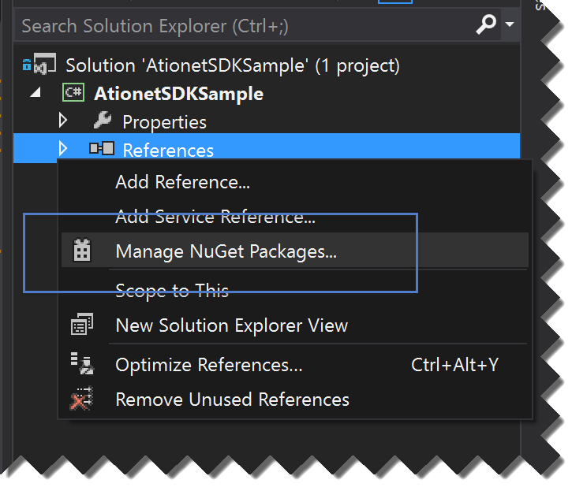

 
# ATIONet .NET SDK Development Guide
> **About:** This document describes and explains how to consume the .NET SDK for all Ationet APIs.	

</br>

<table>
	<thead>
		<tr>
			<td colspan="2" class="tablehead">Document Information</td>
		</tr>
	</thead>
	<tbody>
		<tr>
			<td width="20%" class="rowhead" align="right">File:</td>
			<td>AN-SDK-Specs</td>
		</tr>
		<tr>
			<td align="right">Doc. Version:</td>
			<td>1.0</td>
		</tr>
		<tr>
			<td align="right">Release Date:</td>
			<td>02, September 2014</td>
		</tr>
		<tr>
			<td align="right">Author:</td>
			<td>ATIO International LLC</td>
		</tr>
	</tbody>
</table>

<table>
     <thead>
          <tr>
          	<td colspan="3">Change Log</td>
          </tr>
     </thead>
     <tbody>
        <tr>
          	<td>Ver.</td>
            <td>Date</td>
            <td>Change summary</td>
        </tr>
        <!-- Insert a table row like this for each version -->
        <tr>
          	<td>1.0</td>
          	<td>02/Sept/2014</td>
          	<td>Initial version</td>
        </tr>
        <!-- End of version table row -->
     </tbody>
</table>
</br>

<!--###Table of Content -->

## Contents

<!-- MarkdownTOC depth=3 -->

- [Introduction](#introduction)
- [Download / Installation](#download-installation)
- [Operation Types](#operation-types)
  -  [Auth](#auth)
  -  [FMS](#fms)
  -  [Interface](#interface)
  -  [Loyalty](#loyalty)
  -  [Retail](#retail)
- [Consuming the SDK](#consuming-the-sdk)

<!-- /MarkdownTOC -->

## Introduction
The ATIONet SDK (Software development Kit) helps any developer that wants to interact with ATIONet Platform. If you are integrating an existing software or want to extract data out of ATIONet, the SDK will make this much easier, taking care of all the HTTP communication, error handling and retry policies.
ATIONet SDK can be consumed from any .NET language.

## Download / Installation
ATIONet SDK is hosted in [www.nuget.org](http://www.nuget.org). NuGet is the package manager for the Microsoft development platform including .NET. The NuGet client tools provide the ability to produce and consume packages. The NuGet Gallery is the central package repository used by all package authors and consumers.

## Operation Types
ATIONet SDK is able to handle most of the ATIONet modules (Operation Types). This operations are very specific to the responsibility they have in the platform, like for example *Authorization*, *FMS (Fuel Management Systems)*, *Loyalty*, etc. Each of this Operation Type, has a corresponding  module in the SDK. the complete list of *Operations Types* are listed below.

### Auth
The Auth Operation Type is the one in charge of interacting with the authorization engine. The authorization engine is the component that receives authorizations requests and decides if the transaction is approved or not. This SDK Operation Type should be use if you are building a POS or a terminal that will be sending authorization requests to ATIONet. 

### FMS
The FMS Operation Type is the one in charge of interacting with the FMS module. ATIONet supports receiving *Inventory* and *Deliveries* transactions through this interface.

### Interface
The Interface Operation Type was design to be used by 3rd party software that need to get information from ATIONet. With this Operation Type you can download transactions (fleet, loyalty, retail, rejected, approved and exceptions), current account movements, current account balances and loyalty current account.

### Loyalty

### Retail

## Consuming the SDK
For this example we will use Visual Studio 2013 and we will create a Console Application.

1.  Inside Visual Studio create a new Console Application

1.  Once the project is created, open the *Solution Explorer*, right click the project and select *Manage NuGet Packages*. This will open a pop up.


3.  Inside the NuGet pop up, in the left part select *Online*, then in the right top corner type *ationet*. This will bring the list of packages found with this criteria. In this case only 1, **Ationet SDK**. Click *Install*, this will install the Ationet SDK packages and dependencies. Please accept terms and conditions for dependencies packages. 


1.  In the sample below you will see how to download transactions. Open the Program.cs and type the following code:

```c#
var client = new Ationet.Sdk.Interface.InterfaceOperations("https://native.ationet.com/", 
  "srenzi@atioinc.com", "seb@re#zi1975");
var transactions = client.GetTransactions("9JB", "", "", DateTime.Now.AddDays(-1));

foreach (var tran in transactions.Content)
{
    Console.WriteLine("{0} - {1} - {2}", tran.AuthorizationCode, tran.TerminalCode, tran.ProductAmountDispensed);
}
```
